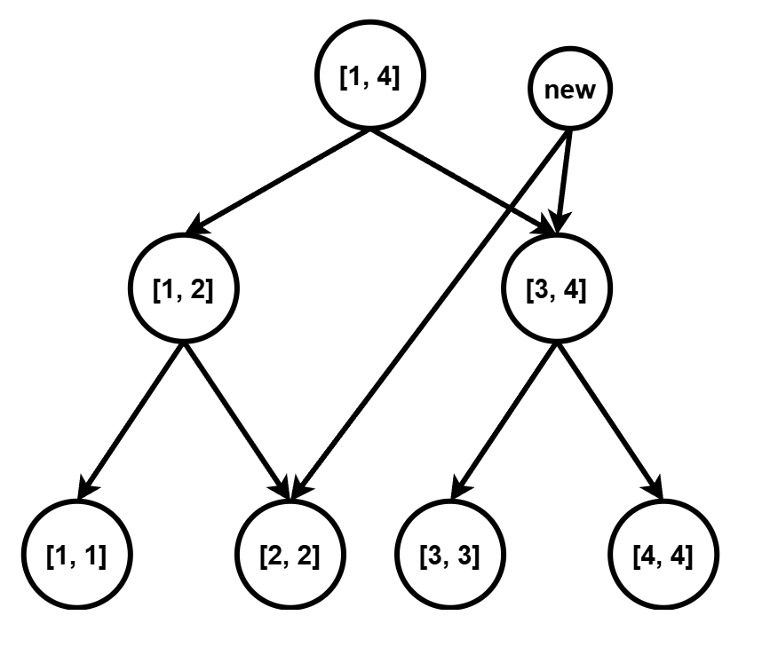
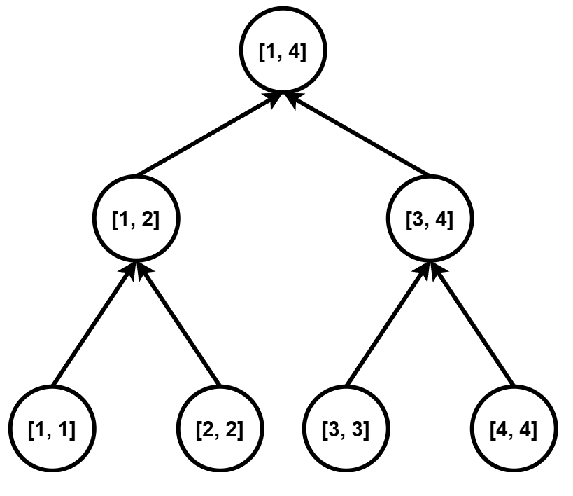

# 常用工具

## 快读函数

### 输入128
```cpp
istream& operator>>(istream& in, i128& x) {
    string s;
    in >> s;

    x = 0;
    bool neg = false;

    int start = 0;
    if (s[0] == '-') {
        neg = true;
        start = 1;
    }

    for (int i = start; i < (int)s.size(); i++) {
        x = x * 10 + (s[i] - '0');
    }

    if (neg) x = -x;

    return in;
}
```
### 输出i128
```cpp
void print(i128 x){
    if(x==0){
        cout<<x<<'\n';
        return ;
    }
    if(x<0){
        cout<<"-";
        x=-x;
    }
    string s;
    while(x){
        s+=char('0'+x%10);
        x/=10;
    }
    reverse(s.begin(),s.end());
    cout<<s<<'\n';
}
```
```cpp
ostream& operator<<(ostream& out, i128 x) {
    if (x == 0) return out << 0;

    if (x < 0) {
        out << '-';
        x = -x;
    }

    string s;
    while (x) {
        s += char('0' + x % 10);
        x /= 10;
    }

    reverse(s.begin(), s.end());
    return out << s;
}
```

## 测试运行时间

下面输出的是程序的运行时间，不包括静态变量和程序启动的时间，包括动态初始化的时间（比如函数内部的vector)，时间单位为ms

```cpp
auto start=chrono::steady_clock::now();
int t = 1;
while (t--) {
    sol();
}
auto end=chrono::steady_clock::now();
cout<<chrono::duration<double,milli>(end-start).count();
```

下面的更为接近一点,要求从文件进行读入

```bash
g++ main.cpp -std=c++17 -O2 -o main
time ./main < input.txt >output.txt
```

## 内存计算

类型大小可以通过sizeof()函数进行查看，1MB=1024KB=1024*1024byte，1byte=8bit

| 类型               | 大小/byte                           |
| ------------------ | ----------------------------------- |
| char               | 1                                   |
| short              | 2                                   |
| int                | 4                                   |
| long long          | 8                                   |
| double             | 8                                   |
| float              | 4                                   |
| long double        | 不固定，sizeof(long double)可以查看 |
| bool               | 1                                   |
| unsigned long long | 8                                   |
| __int128_t         | 16                                  |

特殊的,```vector<bool>```会把每一个压缩成1bit一个

# 数据结构

## 树状数组
```cpp
int lowbit(int x){return x&(-x);}
```
树状数组管辖区间
$c[x]=[x-lowbit(x)+1,x]$
其中$lowbit$为最低位1的位数k的$2^k$

**性质1：对于$x\leq y$，要么有$c[x]$和$c[y]$不交，要么有$c[x]$包含于$c[y]$**

**性质2：$c[x]$真包含于$c[x+lowbit(x)]$**

**性质3：对于任意$x<y<x+lowbit(x)$，有$c[x]$和$c[y]$不交**

**$x+lowbit(x)$是$x$的父亲**

* $u<fa[u]$
* $u$大于任何一个$u$的后代，小于任何一个$u$的祖先
* 点$u$的$lowbit$严格小于$fa[u]$的$lowbit$
* 点$x$的高度是$\log_2lowbit(x)$，即$x$二进制最低位1的位数

* $c[u]$真包含于$c[fa[u]]$
* $c[u]$真包含于$c[v]$，其中$v$是$u$的任一祖先
* $c[u]$真包含于$c[v]$，其中$v$是$u$的任一后代
* 对于任意$v'>u$，若$v'$不是$u$的祖先，则$c[u]$和$c[v']$不交
* 对于任意$v<u$，如果$v$不在$u$的子树上，则$c[u]$和$c[v]$不交

* 设$u=s*2^{k+1}+2^k$，其儿子数量为$k=\log2lowbit(u)$，编号分别为$u-2^t(0\leq t<k)$

* 对于任意$v>u$，当且仅当$v$是$u$的祖先，$c[u]$真包含于$c[v]$


### 区间和
$d[i]=a[i]-a[i-1],a[i]=\sum_{j=1}^{i}d[j]$

求区间$a[1......r]$的和，即
$\sum_{i=1}^{r}a_i=\sum_{i=1}^{r}\sum_{j=1}^{i}d_j$
不难发现$d_j$总共被加了$r-j+1$次
所以
$\sum_{i=1}^{r}\sum_{j=1}^{i}d_j=\sum_{i=1}^{r}d_i*(r-i+1)=\sum_{i=1}^{r}d_i*(r+1)-\sum_{i=1}^{r}d_i*i$
需要用两个树状数组分别维护$d_i$和$d_i*i$的和信息

### 区间加
对维护$d_i$的树状数组，对$l$单点加$v$，$r+1$单点加$-v$，对维护$d_i*i$的树状数组，对$l$单点加$v*l$,$r+1$单点加$-v*(r+1)$


### 一维模板
因为常数问题，尽量用什么功能就用什么板子
#### 单点修改、区间查询
```cpp
const int maxn=1e6+10;
int a[maxn],tree[maxn];
int lowbit(int x){
    return x&-x;
}
//n是值域上界
void add(int i,int v){
    while(i<=n){
        tree[i]+=v;
        i+=lowbit(i);
    }
}

int sum(int i){
    int ans=0;
    while(i>0){
        ans+=tree[i];
        i-=lowbit(i);
    }
    return ans;
}

int  query(int l,int r){
    return sum(r)-sum(l-1);
}
```
```cpp
struct BIT {
    int n;
    vector<ll> a;

    BIT(int n = 0) {
        init(n);
    }

    void init(int n_) {
        n = n_;
        a.assign(n + 2, 0);
    }

    // 单点加
    void add(int p, ll v) {
        for (int i = p; i <= n; i += i & -i) {
            a[i] = (a[i] + v) % mod;
        }
    }

    // 前缀和
    ll query(int p) {
        ll res = 0;
        for (int i = p; i; i -= i & -i) {
            res = (res + a[i]) % mod;
        }
        return res;
    }

    // 区间和
    ll rangeQuery(int l, int r) {
        return (query(r) - query(l - 1) + mod) % mod;
    }
};
```
#### 区间修改、区间查询
```cpp
#define ll long long
ll t1[N],t2[N];
int n;
int lowbit(int x){
    return x&(-x);
}

void add(int k,ll v){
    ll v1=k*v;
    while(k<=n){
        t1[k]+=v,t2[k]+=v1;
        k+=lowbit(k);
    }
}

ll getsum(ll *t,int k){
    ll res=0;
    while(k){
        res+=t[k];
        k-=lowbit(k);
    }
    return res;
}

void RegionAdd(int l,int r,ll v){
    add(l,v),add(r+1,-v);
}

ll RegionSum(int l,int r){
    return (r+1ll)*getsum(t1,r)-l*getsum(t1,l-1)-getsum(t2,r)+getsum(t2,l-1);
}

```
底下拿钱易板子改造的，注意r+1不要越界，size()要开大!!!
```cpp
struct BIT {
    int n;
    vector<ll> a, b;
    BIT(int n = 0) {
        init(n);
    }
    void init(int n_) {
        n = n_;
        a.assign(n + 2, 0);
        b.assign(n + 2, 0);
    }
    void add(int p, ll v) {
        for (int i = p; i <= n; i += i & -i) {
            a[i] += v;
            b[i] += 1LL * p * v;
        }
    }
    // 区间加
    void rangeAdd(int l, int r, ll v) {
        add(l, v);
        add(r + 1, -v);
    }
    // 前缀和
    ll query(int p) {
        ll res = 0;
        for (int i = p; i; i -= i & -i) {
            res += 1LL * (p + 1) * a[i] - b[i];
        }
        return res;
    }
    // 区间和
    ll rangeQuery(int l, int r) {
        return query(r) - query(l - 1);
    }
};
```
### 二维模板（区间修改，区间查询）
```cpp
#define ll long long 
ll t1[N][N], t2[N][N], t3[N][N], t4[N][N];
void add(ll x, ll y, ll z) {
  for (int X = x; X <= n; X += lowbit(X))
    for (int Y = y; Y <= m; Y += lowbit(Y)) {
      t1[X][Y] += z;
      t2[X][Y] += z * x;  // 注意是 z * x 而不是 z * X，后面同理
      t3[X][Y] += z * y;
      t4[X][Y] += z * x * y;
    }
}
void RangeAdd(ll xa, ll ya, ll xb, ll yb,
               ll z) {  //(xa, ya) 到 (xb, yb) 子矩阵
  add(xa, ya, z);
  add(xa, yb + 1, -z);
  add(xb + 1, ya, -z);
  add(xb + 1, yb + 1, z);
}
ll ask(ll x, ll y) {
  ll res = 0;
  for (int i = x; i; i -= lowbit(i))
    for (int j = y; j; j -= lowbit(j))
      res += (x + 1) * (y + 1) * t1[i][j] - (y + 1) * t2[i][j] -
             (x + 1) * t3[i][j] + t4[i][j];
  return res;
}
ll RangeAsk(ll xa, ll ya, ll xb, ll yb) {
  return ask(xb, yb) - ask(xb, ya - 1) - ask(xa - 1, yb) + ask(xa - 1, ya - 1);
}
```

## 线段树
#### 标记永久化
懒标记不会溢出的情况下，可以直接打懒标记，然后询问的时候把标记的影响加到答案当中（例如把线段树子节点归并上来的结果加上当前节点的懒标记）
### 线段树优化建图
**入树,对应所有边的终点,父节点连向子节点**

**出树,对应所有边的起点,子节点连向父节点**    

**出树和入树的同一个叶节点可以共用**
**模板(CF786B Legacy)**

```cpp
//type=0入树,type=1出树
#define ll long long 
#define pli pair<ll,int>
#define mid ((l+r)>>1)

const int N=1e5+10;
int cnt,rt1,rt2;
int ls[N*10],rs[N*10],tr[N*10];
bool vis[N*10];
ll dis[N*10];

struct Edge{
    int v;
    ll w;
};

vector<Edge> e[N*10];

int build(int l,int r,int type){
    if(l==r) return l;
    int rt=++cnt;
    ls[rt]=build(l,mid,type);
    rs[rt]=build(mid+1,r,type);
    
    if(type==0){//入树,父连子
        e[rt].push_back({ls[rt],0});
        e[rt].push_back({rs[rt],0});
    }else{//出树,子连父
        e[ls[rt]].push_back({rt,0});
        e[rs[rt]].push_back({rt,0});
    }
    return rt;
}

void update(int i,int l,int r,int jl,int jr,int v,ll w,int type){
    if(jl<=l&&r<=jr){
        if(type==0) e[v].push_back({i,w});
        else e[i].push_back({v,w});
        return ;
    }
    if(jl<=mid) update(ls[i],l,mid,jl,jr,v,w,type);
    if(jr>mid) update(rs[i],mid+1,r,jl,jr,v,w,type);
}

void sol() {
    int n,q,s;
    cin>>n>>q>>s;
    cnt=n;
    rt1=build(1,n,0),rt2=build(1,n,1);
    for(int i=1;i<=q;i++){
        int t;cin>>t;
        if(t==1){
            int v,u;ll w;
            cin>>v>>u>>w;
            e[v].push_back({u,w});
        }else{
            int v,l,r; ll w;
            cin>>v>>l>>r>>w;
            if(t==2) update(rt1,1,n,l,r,v,w,0);
            else update(rt2,1,n,l,r,v,w,1);
        }
    }

    priority_queue<pli,vector<pli>,greater<pli>> Q;
    fill(dis,dis+cnt,1e18);
    Q.push(make_pair(0ll,s));
    dis[s]=0;
    while(Q.size()){
        auto [d,u]=Q.top();
        Q.pop();
        if(vis[u]) continue;
        vis[u]=true;
        for(auto [v,w]:e[u]){
            if(dis[v]>dis[u]+w){
                dis[v]=dis[u]+w;
                Q.push(make_pair(dis[v],v));
            }
        }
    }
    for(int i=1;i<=n;i++){
        cout<<((dis[i]!=1e18)?dis[i]:-1)<<" ";
    }
}
```
## 分块
### 区间加&区间查询大于某个数的个数
对数列进行分块，整块的加打上懒标记。不够一个块的暴力插/改，每次改完之后不完整的块要重新复制一遍并进行块内排序。一个块的查直接在块内二分即可。
时间复杂度$O(Q\sqrt{n}\log{\sqrt{n}})$

```cpp
const int N=1e6+10;
ll a[N],st[N],lazy[1010];
int bi[N],bl[1010],br[1010];
int blo,num;
//对第k块进行拷贝并排序
void Sort(int k){
    for(int i=bl[k];i<=br[k];i++) st[i]=a[i];
    sort(st+bl[k],st+br[k]+1);
}
void Modify(int l,int r,ll c){
    int x=bi[l],y=bi[r];
    if(x==y){
        for(int i=l;i<=r;i++) a[i]+=c;
        Sort(x);
    }else{
        for(int i=l;i<=br[x];i++) a[i]+=c;
        for(int i=bl[y];i<=r;i++) a[i]+=c;
        for(int i=x+1;i<y;i++){
            lazy[i]+=c;
        }
        Sort(x);
        Sort(y);
    }
}
ll query(int l,int r,ll c){
    int x=bi[l],y=bi[r],ans=0;
    if(x==y){
        for(int i=l;i<=r;i++) ans+=(a[i]>=(c-lazy[x]));
    }else{
        for(int i=l;i<=br[x];i++) ans+=(a[i]>=(c-lazy[x]));
        for(int i=bl[y];i<=r;i++) ans+=(a[i]>=(c-lazy[y]));
        for(int i=x+1;i<=y-1;i++){
            ans+=(st+br[i]+1-lower_bound(st+bl[i],st+br[i]+1,c-lazy[i]));
        }
    }
    return ans;
}
void sol() {
    int n,q;
    cin>>n>>q;
    for(int i=1;i<=n;i++){
        cin>>a[i];
        st[i]=a[i];
    }
    blo=sqrt(n);
    num=(n+blo-1)/blo;
    for(int i=1;i<=n;i++){
        bi[i]=(i-1)/blo+1;
    }
    for(int i=1;i<=num;i++){
        bl[i]=blo*(i-1)+1;
        br[i]=min(i*blo,n);
    }
    for(int i=1;i<=num;i++){
        sort(st+bl[i],st+br[i]+1);
    }
    while(q--){
        char op;
        int l,r,w;
        cin>>op;
        cin>>l>>r>>w;
        if(op=='A'){
            cout<<query(l,r,w)<<'\n';
        }else{
            Modify(l,r,w);
        }
    }
}
```
## 笛卡尔树

1. 笛卡尔树是二叉树,$(k,w)$分别具有二叉搜索树和堆的性质
2. 笛卡尔树的权值中序遍历序列为原数组a,中序遍历序列对应原数组的下标是$1\rightarrow n$
3. **笛卡尔树的权值满足小根堆/大根堆性质**。即对于笛卡尔树上任意非根结点$ u$，设 $f_a$ 为其父亲，则必有 $b_u≥b_{fa}$（小根堆），$b_u≤b_{f_a}$​（大根堆）。

对于小根笛卡尔树，有如下性质：

1. **对于树上一条深度单调递增的路径，其权值单调不减。**
2. 对于任意两点$u,v,(u\le v)$，以$lca(u,v))$为根的子树一定包含a序列中$[u,v]$​区间的所有位置。换言之，笛卡尔树中任意一个完整的子树的节点集合在a中连续。
3. 对于任意两点$u,v,(u\le v)$，其在笛卡尔树的最近公共祖先的权值$b_{lca(u,v)}$恰好等于a序列$[u,v]$的最小值

构建方法：不断维护右链，如果插入节点权值小于当前比较的节点的权值的话，就继续向上比较，如果不是就把当前的节点放到插入节点的左链，然后插入节点接到当前节点的父节点的右节点。如果出栈条件是严格的不含等号出栈，那么可以保证相同值的情况下，下标更大的始终在下标更小的右链上面，那么此时$u,v$两点的lca就是区间$[u,v]$的最靠左取区间最大值的位置。


```cpp
for(int i=1;i<=n;i++){
    int last=0;
    while(stk.size()&&a[stk.top()]>a[i]){
        last=stk.top();
        stk.pop();
    }
    if(stk.size()) rs[stk.top()]=i;
    if(last) ls[i]=last;
    stk.push(i);
}
```

## ST表

1base的区间最大值，0base和区间最小以及区间和同理。1base的n和i+(1<<j)需要-1，但是0base时候不用

```cpp
template<typename T>
struct ST{
    vector<vector<T>> st;
    int n;
    ST(const vector<T>& a){
        n=a.size()-1;
        int k=__lg(n);
        st.assign(k+1,vector<T>(n+1));
       	for(int i=1;i<=n;i++) st[0][i]=a[i];
        for(int j=1;j<=k;j++){
            for(int i=1;i+(1<<j)-1<=n;i++){
                st[j][i]=max(st[j-1][i],st[j-1][i+(1<<(j-1))]);
            }
        }
    }
    T query(int l,int r){
        int k=__lg(r-l+1);
        return max(st[k][l],st[k][r-(1<<k)+1]);
    }
};
```


# 数学

$$\sum_{i=1}^n i^2=\frac{n\times(n+1)\times(2n+1)}{6}$$
## 绝对值问题
绝对值问题要取绝对值，要不然分类讨论，要不然是$|a-b|=max(a-b,b-a)$，要不然$|x|=\max(sx),s\in\{-1,1\}$
$\max\{x,y\}=\frac{x+y+|x-y|}{2}$
## 进制
### 结论
*   十进制下的数字$x$，对于$b$进制，如果有$x> b> \sqrt x$，那么在$b$进制下$x$一定只有**两位**
证明:   $\lfloor\frac{x}{b}\rfloor<\sqrt{x}<b$，$\overline{(\lfloor\frac{x}{b}\rfloor)(x \bmod b)}_b$恰好为二位数

$a+b=a\oplus b+2a\& b$

## 位运算小技巧
从低到高取前$i$位：$mask\&((1<<i)-1)$​

### 最大公约数

```cpp
int gcd(int a,int b){
	return b?gcd(b,a%b):a;
}
```


## 数论
$k|\gcd(i,j)\iff k|i且k|j$
### 筛法
#### 欧拉筛
```cpp
const int N=1e6+10;
bool vis[N+1];
int prime[N/2+1];
int cnt=0;
//每个数都一定由自己最小的质因数被除掉
//但是要判断一下如果一个数能够被当前的因子整除的话
//那么到了他们之间的质因子时，就不是一个数被最小的质因数整除了，因为大的数可以被拆解为它的因子
void init(){
    for(ll i=2;i<N;i++){
        if(!vis[i]){
            prime[cnt++]=i;
        }
        for(int j=0;j<cnt;j++){
            if(i*prime[j]>=N){
                break;
            }
            vis[i*prime[j]]=true;
            if(i%prime[j]==0){
                break;
            }
        }
    }
}
```
### 高精度
如果是简易的大数取模，可以从左向右逐位扫，或者费马小定理求


### 欧拉函数

小于等于$n$和$n$互质的数的个数。

若$\gcd(a,b)=1,\varphi(ab)=\varphi(a)\varphi(b)$

当$n$时奇数时，$\varphi(2n)=\varphi(n)$

$n=p^k,p$为质数，则$\varphi(n)=p^k-p^{k-1}$

$\varphi(n)=n\times \Pi_{i=1}^s\frac{p_i-1}{p_i}$

对任意不全为$0$的整数$m,n$，$\varphi(mn)\varphi(\gcd(m,n))=\varphi(m)\varphi(n)\gcd(m,n)$

#### 求单个数的欧拉函数

```cpp
int euler_phi(int n){
	int ans=n;
    for(int i=2;i*i<=n;i++){
        if(n%i==0){
            ans=ans/i*(i-1);
            while(n%i==0) n/=i;
        }
    }
    if(n>1) ans=ans/n*(n-1);
    return ans;
}
```


### 费马小定理&欧拉定理

####  费马小定理
**设$p$是素数，对于任意整数$a$且$p\nmid a$，都成立$a^{p-1}\equiv1 \pmod{p}$**
**设$p$是素数，对于任意整数$a$，都成立$a^{p}\equiv a \pmod{p}$**

####  欧拉定理
**对于整数$m>0$和整数$a$，且$gcd(a,m)=1$，有$a^{\varphi(m)}\equiv1 \pmod{m}$，其中$\varphi(\cdot)$为欧拉函数**

####  扩展欧拉定理
**对于任意正整数$m$、整数$a$和非负整数$k$，有**
$$
a^k \equiv \begin{cases} 
a^{k \bmod \varphi(m)}, & \gcd(a, m) = 1, \\ 
a^k, & \gcd(a, m) \neq 1, k < \varphi(m), \\ 
a^{(k \bmod \varphi(m)) + \varphi(m)}, & \gcd(a, m) \neq 1, k \ge \varphi(m). 
\end{cases} \pmod m
$$

### 原根&阶
在模$m$意义下，$a^k$循环节为$\varphi(m)$，但不一定是最短的循环节。

阶$\delta_m(a)$：满足同余式$a^n\equiv 1\pmod m$的最小正整数解$n$存在，则$n$为$a$模$m$的阶，记做$\delta_m(a)$或$ord_m a$。
原根：设$a\in \Z$，$m\in \N^*$，若$\delta_m(a)=\varphi(m)$，则称$a$为模$m$的一个原根。

如果$m$存在原根，那么$m$的原根数量为$\varphi(\varphi(m))$。
#### 原根存在定理
一个数存在原根，当且仅当$m=1,2,4,p^\alpha,2p^\alpha$，其中$p$为奇素数，$\alpha \in \N^*$

#### 求全部原根
```cpp
#include <bits/stdc++.h>
using namespace std;

typedef long long LL;
constexpr int N = 1e6 + 10, md = 1e9 + 7;

int primes[N], tot; //素数表
bool isnp[N]; //是否为合数或1（非素数）
int phi[N]; //欧拉函数

void initPrimes(int n) //线性筛
{
    phi[1]=1;
    isnp[1] = true;
    for(ll i = 2; i <= n; i ++ )
    {
        if(!isnp[i])
        {
            primes[++ tot] = i;
            phi[i] = i - 1;
        }
        for(int j = 1; i*primes[j] <= n; j ++)
        {
            ll t = i * primes[j];
            isnp[t] = true;
            if(i % primes[j] == 0)
            {
                phi[t] = phi[i] * primes[j];
                break;
            }
            phi[t] = phi[i] * (primes[j] - 1);
        }
    }
}
vector<int> getFactors(int x) //获取x的全部约数
{
	vector<int> res;
	for(int i = 1; i <= x / i; i ++ )
	{
		if (x % i == 0)
		{
			res.push_back(i);
			if (i != x / i) 
                res.push_back(x / i);//特判二者相等的情况
		}
	}
	sort(res.begin(), res.end());
	return res;
}
bool exists[N];
void initHaveRoot(int m)
{
    exists[2] = exists[4] = true;
    for(int i = 1; i <= tot; i ++)
    {
        int p = primes[i];
        for(long long pq = p; pq <= m; pq *= p)
        {//筛掉p**q, 2p**q
            exists[pq] = true;
            if(2 * pq < N)
                exists[2 * pq] = true;
        }
    }

}
void init()
{//预处理
    initPrimes(N - 1); //线性筛，可复用
    initHaveRoot(N - 1); //是否存在原根，可复用
}
LL fpow(LL a, int b, int md) //快速幂
{
    LL res = 1;
    while(b)
    {
        if(b & 1)
            res = res * a % md;
        a = a * a % md;
        b >>= 1;
    }
    return res;
}
int getMinRoot(int m)//获取最小原根
{
   if(!exists[m]) //不存在原根
        return 0;
    auto factors = getFactors(phi[m]); //获取所有约数
    for(int i = 1; i < m; i ++ )
    {
        if(__gcd(i, m) == 1)
        {//枚举所有与m互质的i
            bool isRoot = true;
            for(int c : factors)
            {
                if(c != phi[m] && fpow(i, c, m) == 1)
                {
                    isRoot = false;
                    break;
                }
            }
            if(isRoot)
                return i;
        }
    }
    return 0;
}
vector<int> getAllRoot(int m) //获取全部原根
{
    vector<int> v;
    int mi = getMinRoot(m);//先获取最小原根
    if(!mi)
        return v;
    int tmp = mi;
    for(int i = 1; i <= phi[m]; i ++)
    {
        if(__gcd(i, phi[m]) == 1) //枚举互质的i
            v.emplace_back(tmp);
        tmp = tmp * mi % m;
    }
    sort(v.begin(), v.end());
    return v;
}
int main()
{
    init(); //初始化素数表，以及原根存在表
    cin.tie(0), cin.sync_with_stdio(false);
    int T;
    cin >> T;
    while(T -- )
    {
        int n, d;
        cin >> n >> d;
        auto v = getAllRoot(n);
        int c = v.size(); //避免出现unsigned(0) - 1的情况
        int up = c / d;
        cout << c << '\n';
        for(int i = 1; i <= up; i ++ )
            cout << v[i * d - 1] << ' ';
        cout << '\n';
    }
}
```
### 数论分块
$$\lfloor\frac{\lfloor\frac{n}{k}\rfloor}{d}\rfloor=\lfloor\frac{n}{kd}\rfloor$$
### 狄利克雷卷积
*   两个数论函数的Dirichlet卷积为：
$(f*g)(n)=\sum_{d|n}f(d)g(\frac{n}{d})$
*   **性质:**
    *   若数论函数$f,g$都为积性函数，那么$f*g$也为积性函数。
* **单位元:单位函数$\epsilon(n)=[n=1]$**
  * $(f*\epsilon)(n)=\sum_{d|n}f(d)\epsilon(\frac{n}{d})=f(n)$
* **逆元**
  * 若$f*g=\epsilon$，那么称$g$为$f$的狄利克雷逆元。

### 莫比乌斯反演
设 $f(n),g(n)$ 是两个数论函数。那么，有
$$
f(n)=\sum_{d\mid n}g(d)
\iff
g(n)=\sum_{d\mid n}\mu\left(\frac{n}{d}\right)f(d).
$$
#### 莫比乌斯函数
$$
\mu(n)=
\begin{cases}
1, & n=1,\\
0, & \exists d>1,\ d^2\mid n,\\
(-1)^{\omega(n)}, & \text{otherwise}.
\end{cases}
$$
$w(n)$为$n$的本质不同的质因子个数。如果$n$有平方因子，那么为$1$。
*   ##### 性质
$$[n=1]=\sum_{d|n}\mu(d)$$
一个数$n$的所有约数的莫比乌斯函数之和，为这个数的单位函数$\epsilon(n)$
##### 单个$n$求法
时间复杂度$O(\sqrt{n})$
```cpp
int mu(int n){
    int res=1;
    for(int i=2;i*i<=n;i++){
        if(n%i==0){
            n/=i;
            if(n%i==0) return 0;
            res=-res;
        }
    }
    if(n>1) res=-res;
    return res;
}
```
##### 前$n$个正整数求法
利用积性函数性质，用线性筛在$O(n)$时间内进行计算
算上数论分块时间复杂度$O(\sqrt{n}+\sqrt{m})$
```cpp
const int N=5e4+10;
int primes[N],cnt,mu[N],s[N];
bool vis[N];
void init( ){
    mu[1]=1;
    for(ll i=2;i<N;i++){
        if(!vis[i])
            primes[cnt++]=i,mu[i]=-1;
        for(int j=0;j<cnt&&primes[j]*i<N;j++){
            vis[primes[j]*i]=true;
            if(i%primes[j]==0){
                break;
            }
            mu[primes[j]*i]=-mu[i];
        }
    }
    for(int i=1;i<N;i++){
        //计算莫比乌斯函数的前缀和
        s[i]=s[i-1]+mu[i];
    }
}
int g(int n,int i){
    //整除分块，求解跟n / i同样值的最大的右边界r
    return n/(n/i);
}
ll f(int n,int m){
    //算技巧2最右侧式子的函数。
    ll res=0;
    int rn=min(n,m);
    for(int l=1,r;l<=rn;l=r+1){
        r=min({rn,g(n,l),g(m,l)});
        res+=1ll*(s[r]-s[l-1])*(n/l)*(m/l);
    }
    //枚举每个d,让两个下取整都是常数，并且维护前缀和
    return res;
}
```
#### 技巧1
$$
\sum_{i=1}^{n}\sum_{j=1}^{m}[\gcd(i,j)=k]
=
\sum_{i=1}^{\left\lfloor\frac{n}{k}\right\rfloor}
\sum_{j=1}^{\left\lfloor\frac{m}{k}\right\rfloor}
[\gcd(i,j)=1]
$$
#### 技巧2
利用$[d|\gcd(i,j)]\iff[d | i,d|j]$，得到:

$$
\sum_{i=1}^{n}\sum_{j=1}^{m}[\gcd(i,j)=1]
=
\sum_{d=1}^{\min(n,m)}
\mu(d)
\sum_{i=1}^{n}[d\mid i]
\sum_{j=1}^{m}[d\mid j]
=
\sum_{d=1}^{\min(n,m)}
\mu(d)
\left\lfloor\frac{n}{d}\right\rfloor
\left\lfloor\frac{m}{d}\right\rfloor
$$

上式右侧可以用数论分块在$O(\sqrt{n}+\sqrt{m})$内进行求解。
#### 技巧3
若$n\le m$，令$d=gcd(i,j),i=i'd,j=j'd$，则
$$
\begin{aligned}
&\sum_{i=1}^{n}\sum_{j=1}^{m} f(\gcd(i,j))\\
={}&
\sum_{d=1}^{\min(n,m)}
\sum_{i'=1}^{\left\lfloor \frac{n}{d}\right\rfloor}
\sum_{j'=1}^{\left\lfloor \frac{m}{d}\right\rfloor}
f(\gcd(i,j))
[\gcd(i',j')=1]\\
={}&
\sum_{d=1}^{n}
\sum_{i=1}^{\left\lfloor \frac{n}{d}\right\rfloor}
\sum_{j=1}^{\left\lfloor \frac{m}{d}\right\rfloor}
f(d)[\gcd(i,j)=1]
\end{aligned}
$$
#### 技巧4(欧拉反演)

$$
n=\sum_{d|n}\varphi(d)\\
\gcd(a,b)=\sum_{d|\gcd(a,b)}\varphi(d)=\sum_d [d|a][d|b]\varphi(d)\\
\sum_{i=1}^n \gcd(i,n)=\sum_d\sum_{i=1}^n[d|i][d|n]\varphi(d)=\sum_d\lfloor\frac{n}{d}\rfloor[d|n]\varphi(d)=\sum_{d|n}\lfloor\frac{n}{d}\rfloor\varphi(d)
$$

#### 技巧5（$\gcd$不好计算，并且函数在整除关系上单调，考虑转化为整除然后取$\max,\min$)

对于$\gcd$不好处理的话，如果$f(d_1)\le f(d),d_1|d$的话，那么考虑转化为$f(\gcd(a,b))=\max_{d|x,d|a_i}f(d)$，因为整除关系要更好处理。

#### 狄利克雷前缀和

实际上就是认为在整除的偏序关系下面，把每一个素数看成维度，那么一个数可以表示成在这些素数的维度下的坐标，每一维的坐标表示这个数中包含多少个这个素数，那么前缀和就表示为所有坐标每一维都小于等于它的函数之和。那么就是高维前缀和，只需要依次对每一维依次计算即可。

##### **Dirichlet前缀和**

时间复杂度$O(n\log\log n)$

```cpp
for(int i=1;i<=tot;i++){
	for(ll d=1;p[i]*d<=n;d++){
		a[p[i]*d]+=a[d];
    }
}
```

##### Dirichlet后缀和

跟前缀和原理差不多，只不过是在维度下变成了所有坐标大于等于它的位置数字之和，那么只需要从高到低对每一维做后缀和即可。每次都是对当前的位置处理处在当前这一维度下它的前面一个位置的前缀和。也是$O(n\log \log n)$

```cpp
for(int i=1;i<=tot;i++){
	for(ll d=n/p[i];d>=1;d--){
        a[d]+=a[d*p[i]];
    }
}
```


## 多项式

### 技巧
如果某一项有负数的话，考虑平移。
如果是差卷积形式，考虑翻转数组。
### 全家桶

里面是NTT
```cpp
//模数和原根要进行对应的改变
constexpr int P = 998244353;
using i64 = long long;
// assume -P <= x < 2P
int norm(int x) {
    if (x < 0) {
        x += P;
    }
    if (x >= P) {
        x -= P;
    }
    return x;
}
template<class T>
T power(T a, int b) {
    T res = 1;
    for (; b; b /= 2, a *= a) {
        if (b % 2) {
            res *= a;
        }
    }
    return res;
}
struct Z {
    int x;
    Z(int x = 0) : x(norm(x)) {}
    int val() const {
        return x;
    }
    Z operator-() const {
        return Z(norm(P - x));
    }
    Z inv() const {
        assert(x != 0);
        return power(*this, P - 2);
    }
    Z &operator*=(const Z &rhs) {
        x = i64(x) * rhs.x % P;
        return *this;
    }
    Z &operator+=(const Z &rhs) {
        x = norm(x + rhs.x);
        return *this;
    }
    Z &operator-=(const Z &rhs) {
        x = norm(x - rhs.x);
        return *this;
    }
    Z &operator/=(const Z &rhs) {
        return *this *= rhs.inv();
    }
    friend Z operator*(const Z &lhs, const Z &rhs) {
        Z res = lhs;
        res *= rhs;
        return res;
    }
    friend Z operator+(const Z &lhs, const Z &rhs) {
        Z res = lhs;
        res += rhs;
        return res;
    }
    friend Z operator-(const Z &lhs, const Z &rhs) {
        Z res = lhs;
        res -= rhs;
        return res;
    }
    friend Z operator/(const Z &lhs, const Z &rhs) {
        Z res = lhs;
        res /= rhs;
        return res;
    }
    friend std::istream &operator>>(std::istream &is, Z &a) {
        i64 v;
        is >> v;
        a = Z(v);
        return is;
    }
    friend std::ostream &operator<<(std::ostream &os, const Z &a) {
        return os << a.val();
    }
};

std::vector<int> rev;
std::vector<Z> roots{0, 1};
void dft(std::vector<Z> &a) {
    int n = a.size();
    
    if (int(rev.size()) != n) {
        int k = __builtin_ctz(n) - 1;
        rev.resize(n);
        for (int i = 0; i < n; i++) {
            rev[i] = rev[i >> 1] >> 1 | (i & 1) << k;
        }
    }
    
    for (int i = 0; i < n; i++) {
        if (rev[i] < i) {
            std::swap(a[i], a[rev[i]]);
        }
    }
    if (int(roots.size()) < n) {
        int k = __builtin_ctz(roots.size());
        roots.resize(n);
        while ((1 << k) < n) {
            Z e = power(Z(3), (P - 1) >> (k + 1));
            for (int i = 1 << (k - 1); i < (1 << k); i++) {
                roots[2 * i] = roots[i];
                roots[2 * i + 1] = roots[i] * e;
            }
            k++;
        }
    }
    for (int k = 1; k < n; k *= 2) {
        for (int i = 0; i < n; i += 2 * k) {
            for (int j = 0; j < k; j++) {
                Z u = a[i + j];
                Z v = a[i + j + k] * roots[k + j];
                a[i + j] = u + v;
                a[i + j + k] = u - v;
            }
        }
    }
}
void idft(std::vector<Z> &a) {
    int n = a.size();
    std::reverse(a.begin() + 1, a.end());
    dft(a);
    Z inv = (1 - P) / n;
    for (int i = 0; i < n; i++) {
        a[i] *= inv;
    }
}
struct Poly {
    std::vector<Z> a;
    Poly() {}
    Poly(const std::vector<Z> &a) : a(a) {}
    Poly(const std::initializer_list<Z> &a) : a(a) {}
    int size() const {
        return a.size();
    }
    void resize(int n) {
        a.resize(n);
    }
    Z operator[](int idx) const {
        if (idx < size()) {
            return a[idx];
        } else {
            return 0;
        }
    }
    Z &operator[](int idx) {
        return a[idx];
    }
    Poly mulxk(int k) const {
        auto b = a;
        b.insert(b.begin(), k, 0);
        return Poly(b);
    }
    Poly modxk(int k) const {
        k = std::min(k, size());
        return Poly(std::vector<Z>(a.begin(), a.begin() + k));
    }
    Poly divxk(int k) const {
        if (size() <= k) {
            return Poly();
        }
        return Poly(std::vector<Z>(a.begin() + k, a.end()));
    }
    friend Poly operator+(const Poly &a, const Poly &b) {
        std::vector<Z> res(std::max(a.size(), b.size()));
        for (int i = 0; i < int(res.size()); i++) {
            res[i] = a[i] + b[i];
        }
        return Poly(res);
    }
    friend Poly operator-(const Poly &a, const Poly &b) {
        std::vector<Z> res(std::max(a.size(), b.size()));
        for (int i = 0; i < int(res.size()); i++) {
            res[i] = a[i] - b[i];
        }
        return Poly(res);
    }
    friend Poly operator*(Poly a, Poly b) {
        if (a.size() == 0 || b.size() == 0) {
            return Poly();
        }
        int sz = 1, tot = a.size() + b.size() - 1;
        while (sz < tot) {
            sz *= 2;
        }
        a.a.resize(sz);
        b.a.resize(sz);
        dft(a.a);
        dft(b.a);
        for (int i = 0; i < sz; ++i) {
            a.a[i] = a[i] * b[i];
        }
        idft(a.a);
        a.resize(tot);
        return a;
    }
    friend Poly operator*(Z a, Poly b) {
        for (int i = 0; i < int(b.size()); i++) {
            b[i] *= a;
        }
        return b;
    }
    friend Poly operator*(Poly a, Z b) {
        for (int i = 0; i < int(a.size()); i++) {
            a[i] *= b;
        }
        return a;
    }
    Poly &operator+=(Poly b) {
        return (*this) = (*this) + b;
    }
    Poly &operator-=(Poly b) {
        return (*this) = (*this) - b;
    }
    Poly &operator*=(Poly b) {
        return (*this) = (*this) * b;
    }
    Poly deriv() const {
        if (a.empty()) {
            return Poly();
        }
        std::vector<Z> res(size() - 1);
        for (int i = 0; i < size() - 1; ++i) {
            res[i] = (i + 1) * a[i + 1];
        }
        return Poly(res);
    }
    Poly integr() const {
        std::vector<Z> res(size() + 1);
        for (int i = 0; i < size(); ++i) {
            res[i + 1] = a[i] / (i + 1);
        }
        return Poly(res);
    }
    Poly inv(int m) const {
        Poly x{a[0].inv()};
        int k = 1;
        while (k < m) {
            k *= 2;
            x = (x * (Poly{2} - modxk(k) * x)).modxk(k);
        }
        return x.modxk(m);
    }
    Poly log(int m) const {
        return (deriv() * inv(m)).integr().modxk(m);
    }
    Poly exp(int m) const {
        Poly x{1};
        int k = 1;
        while (k < m) {
            k *= 2;
            x = (x * (Poly{1} - x.log(k) + modxk(k))).modxk(k);
        }
        return x.modxk(m);
    }
    Poly pow(int k, int m) const {
        int i = 0;
        while (i < size() && a[i].val() == 0) {
            i++;
        }
        if (i == size() || 1LL * i * k >= m) {
            return Poly(std::vector<Z>(m));
        }
        Z v = a[i];
        auto f = divxk(i) * v.inv();
        return (f.log(m - i * k) * k).exp(m - i * k).mulxk(i * k) * power(v, k);
    }
    Poly sqrt(int m) const {
        Poly x{1};
        int k = 1;
        while (k < m) {
            k *= 2;
            x = (x + (modxk(k) * x.inv(k)).modxk(k)) * ((P + 1) / 2);
        }
        return x.modxk(m);
    }
    Poly mulT(Poly b) const {
        if (b.size() == 0) {
            return Poly();
        }
        int n = b.size();
        std::reverse(b.a.begin(), b.a.end());
        return ((*this) * b).divxk(n - 1);
    }
    std::vector<Z> eval(std::vector<Z> x) const {
        if (size() == 0) {
            return std::vector<Z>(x.size(), 0);
        }
        const int n = std::max(int(x.size()), size());
        std::vector<Poly> q(4 * n);
        std::vector<Z> ans(x.size());
        x.resize(n);
        std::function<void(int, int, int)> build = [&](int p, int l, int r) {
            if (r - l == 1) {
                q[p] = Poly{1, -x[l]};
            } else {
                int m = (l + r) / 2;
                build(2 * p, l, m);
                build(2 * p + 1, m, r);
                q[p] = q[2 * p] * q[2 * p + 1];
            }
        };
        build(1, 0, n);
        std::function<void(int, int, int, const Poly &)> work = [&](int p, int l, int r, const Poly &num) {
            if (r - l == 1) {
                if (l < int(ans.size())) {
                    ans[l] = num[0];
                }
            } else {
                int m = (l + r) / 2;
                work(2 * p, l, m, num.mulT(q[2 * p + 1]).modxk(m - l));
                work(2 * p + 1, m, r, num.mulT(q[2 * p]).modxk(r - m));
            }
        };
        work(1, 0, n, mulT(q[1].inv(n)));
        return ans;
    }
};
//算NTT
void sol() {
    ll n,m;
    cin>>n>>m;
    Poly A,B;
    A.resize(n),B.resize(m);
    for(int i=0;i<n;i++) cin>>A[i];
    for(int i=0;i<m;i++) cin>>B[i];
    Poly C=A*B;
    for(int i=0;i<n+m-1;i++) cout<<C[i]<<" ";
}
```
### FFT
计算$C(x)=A(x)*B(x)$
计算如下式子：
$$C_k=\sum_{i+j=k}a_ib_j$$
#### 常用技巧
1. $a$的下标和$b$的下标差为定值，那么需要翻转其中一个使得他们的下标和为定值,例如$x,x+k$可以翻转为$m-1-x,x+k$，那么下标之和就是$m-1+k$。
2.  对于取模问题可以用某个数组延长二倍的方式去掉取模的影响使得他们为定值(2025郑州邀请赛K)

#### 模板
```cpp
const int N = 4e6 + 10, M = 1e3 + 10;
const double PI = acos(-1);

int T, n, m;

struct Complex
{
    double x, y;
    Complex operator+(const Complex &t) const
    {
        return {x + t.x, y + t.y};
    }
    Complex operator-(const Complex &t) const
    {
        return {x - t.x, y - t.y};
    }
    Complex operator*(const Complex &t) const
    {
        return {x * t.x - y * t.y, x * t.y + y * t.x};
    }

} a[N], b[N];

int rev[N], bit, tot, res[N];
void fft(Complex a[], int inv)
{
    for (int i = 0; i < tot; i++)
    {
        if (i < rev[i])
            swap(a[i], a[rev[i]]); //只需要交换一次就行了，交换两次等于没有换
    }
    for (int mid = 1; mid < tot; mid <<= 1)
    {
        auto w1 = Complex({cos(PI / mid), inv * sin(PI / mid)});
        for (int i = 0; i < tot; i += mid * 2)
        {
            auto wk = Complex({1, 0});                  //初始为w(0,mid),定义为w(k,mid)
            for (int j = 0; j < mid; j++, wk = wk * w1) //单位根递推式
            {
                auto x = a[i + j], y = wk * a[i + j + mid];
                a[i + j] = x + y, a[i + j + mid] = x - y;
            }
        }
    }
}

void workFFT(int n, int m)
{// a[0, n], b[0, m]
    while ((1 << bit) < n + m + 1)
        bit++;
    tot = 1 << bit;
    for (int i = 0; i < tot; i++)
        rev[i] = (rev[i >> 1] >> 1) | ((i & 1) << (bit - 1));
    //递推(bit<<1)在bit之前，就已经被算出rev,最后一位是否为1
    fft(a, 1), fft(b, 1);
    for (int i = 0; i < tot; i++)
        a[i] = a[i] * b[i]; //点表示法直接运算
    fft(a, -1);//逆变换，点表示法转换为多项式表示法
    for (int i = 0; i <= n + m; i++)
        res[i]  = (int)(a[i].x / tot + 0.5); //向上去整
}

int main()
{
    cin.tie(0);
    cout.tie(0);
    cin >> n >> m;
    for (int i = 0; i <= n; i++)
        cin >> a[i].x;
    for (int i = 0; i <= m; i++)
        cin >> b[i].x;
    workFFT(n, m);
    for (int i = 0; i <= n + m; i++)
        cout << res[i] << ' ';
}
```
### NTT
计算$C(x)=A(x)*B(x)\pmod m$
## 概率论
### 期望
*   常从定义出发，按照定义进行计算，套用期望的计算公式，离散/连续
*   从期望的线性性出发，把期望拆解为每一个子事件的期望然后进行求和

$n$个在$[0,m]$区间服从均匀分布的随机变量中从大到小第$i$大的期望是$\frac{n-k+1}{n+1}m$

## 线性代数
### 线性基
#### 二进制线性基
```cpp
struct LB { // Linear Basis
    using i64 = long long;
    const int BASE = 63;
    vector<i64> d, p;
    int cnt, flag;

    LB() {
        d.resize(BASE + 1);
        p.resize(BASE + 1);
        cnt = flag = 0;
    }
    bool insert(i64 val) {
        for (int i = BASE - 1; i >= 0; i--) {
            if (val & (1ll << i)) {
                if (!d[i]) {
                    d[i] = val;
                    return true;
                }
                val ^= d[i];
            }
        }
        flag = 1; //可以异或出0
        return false;
    }
    bool check(i64 val) { // 判断 val 是否能被异或得到
        for (int i = BASE - 1; i >= 0; i--) {
            if (val & (1ll << i)) {
                if (!d[i]) {
                    return false;
                }
                val ^= d[i];
            }
        }
        return true;
    }
    i64 ask_max() {
        i64 res = 0;
        for (int i = BASE - 1; i >= 0; i--) {
            if ((res ^ d[i]) > res) res ^= d[i];
        }
        return res;
    }
    i64 ask_min() {
        if (flag) return 0; // 特判 0
        for (int i = 0; i <= BASE - 1; i++) {
            if (d[i]) return d[i];
        }
    }
    void rebuild() { // 第k小值独立预处理，对整个线性基进行高斯消元
        for (int i = BASE - 1; i >= 0; i--) {
            for (int j = i - 1; j >= 0; j--) {
                if (d[i] & (1ll << j)) d[i] ^= d[j];
            }
        }
        for (int i = 0; i <= BASE - 1; i++) {
            if (d[i]) p[cnt++] = d[i];
        }
    }
    i64 kthquery(i64 k) { // 查询能被异或得到的第 k 小值, 如不存在则返回 -1
        if (flag) k--; // 特判 0, 如果不需要 0, 直接删去
        if (!k) return 0;
        i64 res = 0;
        if (k >= (1ll << cnt)) return -1;
        for (int i = BASE - 1; i >= 0; i--) {
            if (k & (1LL << i)) res ^= p[i];
        }
        return res;
    }
    void Merge(const LB &b) { // 合并两个线性基
        for (int i = BASE - 1; i >= 0; i--) {
            if (b.d[i]) {
                insert(b.d[i]);
            }
        }
    }
};
```
#### 三进制线性基
$O(nlogv)$实现插入和查询，$n$为数值个数，$v$为数值上限。
```cpp
/*
    F3Vector的v1表示三进制下为1的位拼出来的数字，v2同理
*/
struct F3Vector{
    ll v1=0,v2=0;
};

F3Vector add(F3Vector a,F3Vector b){

    /*
        v1:a=1&&b=0,a=0&&b=1,a=2&&b=2
        v2:a=2&&b=0,b=0&&a=2,a=1&&b=1
    */
    F3Vector res;
    res.v1=(a.v1&~(b.v1|b.v2))|(b.v1&~(a.v1|a.v2))|(a.v2&b.v2);
    res.v2=(a.v2&~(b.v1|b.v2))|(b.v2&~(a.v1|a.v2))|(a.v1&b.v1);
    return res;
}

struct Linear_Basis{
    F3Vector base[38];

    /*
        三进制下一个数异或自己等于1,2位翻转

        base统一存储当前第i位，三进制下为1的基
    */
    F3Vector mul2(F3Vector a){
        return {a.v2,a.v1};
    }

    F3Vector build(ll x){//创建一个值为x的三进制向量
        F3Vector res;
        for(int i=0;i<=37;i++){
            int d=x%3;
            if(d==1) res.v1|=(1ll<<i);
            else if(d==2) res.v2|=(1ll<<i);
            x/=3;
            if(x==0) break;
        }
        return res;
    }
    void insert(ll x){
        F3Vector v=build(x);//建向量
        for(int i=37;i>=0;i--){
            int d=0;
            if((v.v1>>i)&1) d=1;
            else if((v.v2>>i)&1) d=2;
            if(d==0) continue;//这一位为0,下一位
            if(base[i].v1==0&&base[i].v2==0){
                if(d==2) v=mul2(v);
                base[i]=v;
                return ;
            }

            if(d==1) v=add(v,mul2(base[i]));
            else v=add(v,base[i]);
        }
    }

    bool query(ll x){
        F3Vector v=build(x);
        for(int i=37;i>=0;i--){
            int d=0;
            if((v.v1>>i)&1) d=1;
            else if((v.v2>>i)&1) d=2;

            if(d==0) continue;//这一位为0,下一位
            if(base[i].v1==0&&base[i].v2==0) return false;//不为0,并且没有基消掉，返回
            if(d==1) v=add(v,mul2(base[i]));
            else v=add(v,base[i]); 
        }
        return true;
    }
};
```

## 组合数学
### 预处理组合数
```cpp
#define ll long long 
const int M=2e5+10;
const ll mod=1e9+7;
ll inv[M],fac[M];

ll ksm(ll a,ll b){
    ll res=1;
    while(b){
        if(b&1) res=res*a%mod;
        b>>=1,a=a*a%mod;
    }
    return res;
}

void init(){
    fac[0]=fac[1]=inv[1]=inv[0]=1;
    for(int i=2;i<M;i++) fac[i]=fac[i-1]*i%mod;
    inv[M-1]=ksm(fac[M-1],mod-2);
    for(int i=M-2;i>=2;i--) inv[i]=inv[i+1]*(i+1)%mod;
}

ll C(ll n,ll m){
    if(m>n||m<0||n<0) return 0;
    return fac[n]*inv[m]%mod*inv[n-m]%mod; 
}
```
### 算两次（我也不知道这种方法具体叫什么名，但是类似于算两次的思想吧，横看成岭侧成峰...）
$$\sum_{x} ans(x)=\sum_{i=1}^{m} \sum_{x} [ans(x)\ge i]$$
左侧是按行求和，右侧是按列求和。可以认为是求每个方案$x$对应的权值之和。因为一个正整数$y$可以拆解为$\sum_{i=1}^m [y\ge i]$，所以就把左侧的计数问题转化成右侧每个$i$有多少方案$\ge i$的问题。
### Raney定理
给定长度为 $m$ 的整数序列（实际是一个圆排列），每一项都不超过 $1$，并且所有数的和为正整数 $n$。那么在它的 $m$ 个循环移位位置中，恰好有 $n$ 个位置能够得到“所有非空前缀和均为正”的序列。

**特殊形式：** 对于$x_1,x_2,...,x_m$，如果$\sum_{i=1}^m x_i=1$，则其所有循环移位中恰好有一个满足所有的前缀和都是正数。
### **二项式推论**

#### **对称性**
$$\binom{n}{m}=\binom{n}{n-m} \tag{1}$$

#### **递推式**
$$\binom{n}{k}=\frac{n}{k}\binom{n-1}{k-1}\tag{2}$$
\
$$\binom{n}{m}=\binom{n-1}{m}+\binom{n-1}{m-1}\tag{3}$$

#### **二项式定理特殊情况**
$$\binom{n}{0}+\binom{n}{1}+\cdots+\binom{n}{n}=\sum_{i=0}^{n}\binom{n}{i}=2^n\tag{4}$$

对二项式定理取$a=b=1$得到上式

$$\sum_{i=0}^{n}(-1)^i\binom{n}{i}=[n=0] \tag{5}$$
对二项式定理取$a=1,b=-1$得到上式

$$\sum_{i=0}^k\binom{n}{i}\binom{m}{k-i}=\binom{m+n}{k}\tag{6}$$
范德蒙德卷积

$$\sum_{i=0}^n\binom{n}{i}^2=\binom{2n}{n}
\tag{7}$$

$(6)$的特殊情况，取$n=k=m$即可

$$\sum_{i=0}^ni\binom{n}{i}=n2^{n-1}\tag{8}$$
对$(4)$对应的多项式函数求导得出

$$\sum_{i=0}^ni^2\binom{n}{i}=n(n+1)2^{n-2}\tag{9}$$
与$(8)$类似，用多项式求导证明

$$\sum_{i=0}^n\binom{l}{k}=\binom{n+1}{k+1}\tag{10}$$

朱世杰恒等式,恒等式证明中较常用，考虑$S=\{a_1,a_2,\cdots,a_{n+1}\}$的$k+1$子集数可以得证

$$\binom{n}{r}\binom{r}{k}=\binom{n}{k}\binom{n-k}{r-k}\tag{11}$$
\
$$\sum_{i=0}^n\binom{n-i}{i}=F_{n+1}\tag{12}$$
其中$F$是斐波那契数列

$$\binom{n+k}{k}^2=\sum_{j=0}^k\binom{k}{j}^2\binom{n+2k-j}{2k}\tag{13}$$
李善兰恒等式，通过$(6)$可证

### **二项式反演**

$$g(n)=\sum_{i=0}^n(-1)^i\binom{n}{i}f(i)\iff f(n)=\sum_{i=0}^n(-1)^i\binom{n}{i}g(i)\tag{1}$$
$$g(n)=\sum_{i=0}^n\binom{n}{i}f(i)\iff f(n)=\sum_{i=0}^n(-1)^{n-i}\binom{n}{i}g(i)\tag{2}$$
$$g(n)=\sum_{i=n}^N(-1)^i\binom{i}{n}f(i)\iff f(n)=\sum_{i=n}^N(-1)^i\binom{i}{n}g(i)\tag{3}$$
$$g(n)=\sum_{i=n}^N\binom{i}{n}f(i)\iff f(n)=\sum_{i=n}^N(-1)^{i-n}\binom{i}{n}g(i)\tag{4}$$

其中，
$(1),(2)$中$g(i),f(i)$分别表示**至多有$i$个元素**满足条件的方案数和**恰好有$i$个元素**满足条件的方案数
$(3),(4)$中$g(i),f(i)$分别表示**至少有$i$个元素**满足条件的方案数和**恰好有$i$个元素**满足条件的方案数

### 容斥原理
设 $U$ 中元素有 $n$ 种不同的属性，而第 $i$ 种属性称为 $P_i$，拥有属性 $P_i$ 的元素构成集合 $S_i$，那么


$$
\left|\bigcup_{i=1}^{n} S_i\right|
=
\sum_i |S_i|
-\sum_{i<j}|S_i\cap S_j|
+\sum_{i<j<k}|S_i\cap S_j\cap S_k|
-\cdots
+(-1)^{m-1}
\sum_{a_1<a_2<\cdots<a_m}
\left|\bigcap_{i=1}^{m}S_{a_i}\right|
+\cdots
+(-1)^{n-1}|S_1\cap\cdots\cap S_n|.
$$

对于全集 $U$ 下的集合的并，可以使用容斥原理计算，而集合的交则用全集减去补集的并集求得：

$$
\left|\bigcap_{i=1}^{n} S_i\right|
=
|U|
-
\left|\bigcup_{i=1}^{n} \overline{S_i}\right|
$$

#### Min-max容斥
$\{x_i\}$表示一组序列，长度为$n$，令$S=\{1,2,3,\cdots,n\}$

$$
\max_{i\in S} x_i
=
\sum_{\varnothing\ne T\subseteq S}
(-1)^{|T|-1}
\min_{j\in T} x_j
$$

$$
\min_{i\in S} x_i
=
\sum_{\varnothing\ne T\subseteq S}
(-1)^{|T|-1}
\max_{j\in T} x_j
$$

$$
E\left(
\max_{i\in S} x_i
\right)
=
\sum_{\varnothing\ne T\subseteq S}
(-1)^{|T|-1}
E\left(
\min_{j\in T} x_j
\right)
$$

$$
E\left(
\min_{i\in S} x_i
\right)
=
\sum_{\varnothing\ne T\subseteq S}
(-1)^{|T|-1}
E\left(
\max_{j\in T} x_j
\right)
$$

$$
\operatorname*{kthmax}_{i\in S} x_i
=
\sum_{\varnothing\ne T\subseteq S}
(-1)^{|T|-k}
\binom{|T|-1}{k-1}
\min_{j\in T} x_j
$$

$$
\operatorname*{kthmin}_{i\in S} x_i
=
\sum_{\varnothing\ne T\subseteq S}
(-1)^{|T|-k}
\binom{|T|-1}{k-1}
\max_{j\in T} x_j
$$

$$
E\left(
\operatorname*{kthmax}_{i\in S} x_i
\right)
=
\sum_{\varnothing\ne T\subseteq S}
(-1)^{|T|-k}
\binom{|T|-1}{k-1}
E\left(
\min_{j\in T} x_j
\right)
$$

$$
E\left(
\operatorname*{kthmin}_{i\in S} x_i
\right)
=
\sum_{\varnothing\ne T\subseteq S}
(-1)^{|T|-k}
\binom{|T|-1}{k-1}
E\left(
\max_{j\in T} x_j
\right)
$$
$$
\operatorname*{lcm}_{i\in S} x_i
=
\prod_{\varnothing\ne T\subseteq S}
\left(
\gcd_{j\in T} x_j
\right)^{(-1)^{|T|-1}}
$$


### **范德蒙德卷积公式**

$$\sum_{i=0}^{k}\binom{n}{i}\binom{m}{k-i}=\binom{n+m}{k}$$

**证明**
$$\sum_{k=0}^{n+m}\binom{n+m}{k}x^k=(x+1)^{n+m}=(x+1)^n(x+1)^m=\sum_{r=0}^{n}\binom{n}{r}x^r\sum_{s=0}^{m}\binom{m}{s}x^s=\sum_{k=0}^{n+m}\sum_{r=0}^{k}\binom{n}{r}\binom{m}{k-r}x^k$$

**组合意义**：一个$n+m$个集合取$k$个数，可认为拆成$n$和$m$两个集合，$n$取$i$个，$m$取$k-i$个。

#### **推论**：
##### **推论1**：
$$\sum_{i=-r}^{s}\binom{n}{r+i}\binom{m}{s-i}=\binom{n+m}{r+s}$$

**证明**：
$$\sum_{k=0}^{K} \binom{n}{k} \binom{m}{K-k} = \binom{n+m}{K}$$
**令 $k = r + i$,$K = r + s$,则：**
$$\sum_{k=0}^{K} \binom{n}{k} \binom{m}{K - k} = \binom{n+m}{K} = \binom{n+m}{r+s}$$

##### **推论2**：
$$\sum_{i=1}^{n}\binom{n}{i}\binom{n}{n-1}=\binom{2n}{n-1}$$
**证明**:
$$\sum_{i=1}^{n}\binom{n}{i}\binom{n}{i-1}=\sum_{i=0}^{n-1}\binom{n}{i+1}\binom{n}{i}=\sum_{i=0}^{n-1}\binom{n}{n-1-i}\binom{n}{i}=\binom{2n}{n-1}$$

##### **推论3**:
$$\sum_{i=0}^{n}\binom{n}{i}^{2}=\binom{2n}{n}$$
**证明**:
$$\sum_{i=0}^{n}\binom{n}{i}^{2}=\sum_{i=0}^{n}\binom{n}{i}\binom{n}{n-i}=\binom{2n}{n}$$

##### **推论4**:
$$\sum_{i=0}^{m}\binom{n}{i}\binom{m}{i}=\binom{n+m}{m}$$
**证明**:
$$\sum_{i=0}^{m}\binom{n}{i}\binom{m}{i}=\sum_{i=0}^{m}\binom{n}{i}\binom{m}{m-i}=\binom{n+m}{m}$$


### **第二类斯特林数**

第二类斯特林数
$\left\{ \begin{matrix}
    n\\m
\end{matrix}\right\}$
,也可以记做$S(n,k)$，表示将$n$个两两不同的元素，划分为$k$个互不区分的非空子集的方案数。

#### 递推式
$
\begin{Bmatrix}
    n\\k
\end{Bmatrix}$=$\begin{Bmatrix}
    n-1\\k-1
\end{Bmatrix}$+$k\begin{Bmatrix}
    n-1\\k    
\end{Bmatrix}
$

边界是$
\begin{Bmatrix}
    n\\0
\end{Bmatrix}=[n=0]$
**组合意义证明**：
插入最后一个元素，有两种方案：

* 将新元素单独放入一个子集,有$\begin{Bmatrix}
    n-1\\k-1
    \end{Bmatrix}$中方案
* 将新元素放入一个现有的非空子集，有$k\begin{Bmatrix}
    n-1\\k
    \end{Bmatrix}$ 中方案。
    根据加法原理，两式相加即可得到递推式
#### 通项公式
$$
\begin{Bmatrix}
    n\\m
\end{Bmatrix}=\sum_{i=0}^m\frac{(-1)^{m-i}i^n}{i!(m-i)!}
$$
**证明**：
设将$n$个两两不同的元素,划分到$i$个两两不同的集合(允许空集)的方案数为$G_i$,将$𝑛$个两两不同的元素,划分到$i$个两两不同的非空集合(不允许空集)的方案数为$F_i$．
显然
$$
G_i=i^n\\G_i=\sum_{j=0}^i\binom{i}{j}F_j
$$
根据二项式反演
$$
F_i=\sum_{j=0}^i(-1)^{i-j}\binom{i}{j}G_j\\=\sum_{j=0}^i(-1)^{i-j}\binom{i}{j}j^n\\=\sum_{j=0}^i\frac{i!(-1)^{i-j}j^n}{j!(i-j)!}
$$
考虑 $ F_i$与$\begin{Bmatrix}
    n\\m
\end{Bmatrix}$ 的关系，第二类斯特林数要求集合之间互不区分，因此$F_i$正好就是$\begin{Bmatrix}
    n\\i
\end{Bmatrix}$的$i!$倍，于是
$$\begin{Bmatrix}
    n\\m
\end{Bmatrix}=\frac{F_m}{m!}=\sum_{i=0}^m\frac{(-1)^{m-i}i^n}{i!(m-i)!}
$$
### Dilworth定理

最大反链大小=最小链覆盖数，反链是偏序集上一个集合，其中两两元素互不成偏序关系。链是偏序集上一个集合内部两两元素都有偏序关系。

# 树
## 树的重心
###  定义（满足任意一个就是）:
*   在树中删去结点$v$后，得到的图$
T\setminus\{v\}$中每个连通分量的大小均不超过原树结点数的一半
*   在所有删去某个结点后得到的最大连通分量大小中，删去结点$v$时所得到的值最小
*   树中所有结点到某个结点的距离和中，到结点$v$的距离和最小
### 性质:
*   树的重心如果不唯一，则恰有两个．这两个重心相邻．而且，删去它们的连边后，树将变为两个大小相同的连通分量
*   在一棵树上添加或删除一个叶子，那么它的重心最多只移动一条边的距离
*   把两棵树通过一条边相连得到一棵新的树，那么新树的重心在连接原来两棵树的重心的路径上
*   一棵有根树的重心一定在根结点所在的重链上．一棵树的重心一定是该树根结点重子结点对应子树的重心的祖先
### 求法
#### 法一：DFS
找到最大深度$\le \frac{n}{2}$的所有重心
```cpp
int n;
// 这份代码默认节点编号从 1 开始，即 i ∈ [1,n]
int siz[MAXN],  // 这个节点的「大小」（所有子树上节点数 + 该节点）
    weight[MAXN];  // 这个节点的「重量」，即所有子树「大小」的最大值
vector<int> centroids;  // 用于记录树的重心（存的是节点编号）
vector<int> g[MAXN];
void dfs(int cur, int fa) {  // cur 表示当前节点 (current)
  siz[cur] = 1;
  weight[cur] = 0;
  for (int v : g[cur]) {
    if (v != fa) {  // v 表示这条有向边所通向的节点
      dfs(v, cur);
      siz[cur] += siz[v];
      weight[cur] = max(weight[cur], siz[v]);
    }
  }
  weight[cur] = max(weight[cur], n - siz[cur]);
  if (weight[cur] <= n / 2) {  // 依照树的重心的定义统计
    centroids.push_back(cur);
  }
}
void get_centroids() { dfs(1, 0); }
```
#### 法二:换根dp
换根 DP 计算出以不同结点为根时，所有结点的深度和（即到当前根结点的距离和）．根据定义，只需要找到使得这一深度和最小的结点即可
```cpp
int n, siz[N];
long long dp[N], ans[N];
vector<int> g[N], centroids;

// 求 1 号节点到所有其他节点的距离和
void dfs1(int u, int fa) {
  siz[u] = 1;
  dp[u] = 0;
  for (int v : g[u]) {
    if (v == fa) continue;
    dfs1(v, u);
    siz[u] += siz[v];
    dp[u] += dp[v] + siz[v];  // 子树节点到 u 的距离和
  }
}

// 通过换根 DP 求所有节点为树根时对应的距离和
void dfs2(int u, int fa) {
  for (int v : g[u]) {
    if (v == fa) continue;
    ans[v] = ans[u] - siz[v] + (n - siz[v]);
    dfs2(v, u);
  }
}

// 求树的重心
void get_centroids() {
  dfs1(1, 0);
  ans[1] = dp[1];
  dfs2(1, 0);

  long long mini = std::numeric_limits<long long>::max();
  for (int i = 1; i <= n; i++) {
    if (ans[i] < mini) {
      mini = ans[i];
      centroids = {i};
    } else if (ans[i] == mini)
      centroids.push_back(i);
  }
}
```
#### $O(n)$求出所有子树的重心
对于每棵以结点$u$为根的子树，先求出所有以其直接子结点为根的子树的重心（叶子结点的重心是其本身），然后向上判断路径上的结点是不是重心即可。
因为每个节点至多被判断一次，所以时间复杂度是$O(n)$
```cpp
int n, q;  // 点数，询问数
int fa[N];
vector<int> son[N];
int siz[N],     // 子树大小
    ans[N],     // 以节点 u 为根的子树重心是 ans[u]
    weight[N];  // 节点重量（不包括向上的子树）

void dfs(int u) {
  siz[u] = 1, ans[u] = u;
  for (int v : son[u]) {
    dfs(v);
    fa[v]=u;
    siz[u] += siz[v];
    weight[u] = max(weight[u], siz[v]);
  }
  for (int v : son[u]) {
    int p = ans[v];
    while (p != u) {
      if (max(weight[p], siz[u] - siz[p]) <= siz[u] / 2) {
        ans[u] = p;
        break;
      } else
        p = fa[p];
    }
  }
}
```
## 树的直径
法一dp,法二两次dfs。
## 虚树
### 法一：二次排序+LCA连边

1.  把所有点按DFS序排序
2.  枚举相邻两个数，两两求LCA并加入序列A中
3.  按照DFS从小到大排序并去重
4.  枚举相邻两点编号$x,y$，求$LCA$并连接$LCA(x,y),y$

总时间复杂度$O(klogn)$,$k$为关键点数，$n$为总点数，**常数较大（存疑？）**

### 法二：单调栈法

用单调栈维护虚树上的链，从底部到栈首是递增的。

出入栈时间复杂度$O(\sum k)$，排序和求LCA时间复杂度$O(\sum(k\log k+k\log n)),k$为每次的关键点数

## 技巧
1. 判断点$C$是否在$A<->B$的路径上:$dis(A,B)=dis(A,C)+dis(C,B)$
2. 求点$i$到路径$A-B$的最短距离:$\frac{dis(i,a)+dis(i,b)−dis(a,b)}{2}$

代码
```cpp
vector<int> p(k+1);   
bool yes=false;
for(int i=0;i<k;i++){
    cin>>p[i];
    is[p[i]]=true;
}

if(!is[1]) p.push_back(1);
sort(p.begin(),p.end(),[&](int x,int y)->bool{
    return dfn[x]<dfn[y];
});

stk[++top]=p[0];
int siz=p.size();
for(int i=1;i<siz;i++){
    int lca=LCA(stk[top],p[i]);
    while(top>=2&&dep[stk[top-1]]>=dep[lca]){
        vt[stk[top-1]].push_back(stk[top--]);
    }
    if(lca^stk[top]){ vt[lca].push_back(stk[top]);  stk[top]=lca; p.push_back(lca);}
    stk[++top]=p[i];
}
while(top) vt[stk[top-1]].push_back(stk[top--]);
dfs(1,yes);
if(yes) cout<<"-1\n";
else    cout<<f[1]<<'\n';
for(int i=0;i<p.size();i++){
    g[p[i]]=is[p[i]]=false;
    f[p[i]]=0;
    vt[p[i]].clear();
} 
top=0;
```
## 树上启发式合并   
对于需要处理每个子树内的信息，并且不同子树之间的答案可以使用全局桶进行合并的时候，可以采用
### 一般流程:
*   遍历每一个节点
    * 递归解决所有轻儿子，同时消除轻儿子的贡献
*   递归重儿子，不消除重儿子的贡献
*   统计所有轻儿子的贡献
*   更新该节点的答案
*   如果当前节点不是父节点的重儿子，清空自己节点子树的贡献

### 模板
```cpp
vector<int> e[N];
int c[N],siz[N],son[N];
int cnt[N],ans[N];
int Mx,sum;
void add(int u,int fa,int val,int ban){
    int col=c[u];
    if(val==1){
        cnt[col]++;
        if(cnt[col]>Mx){
            Mx=cnt[col];
            sum=col;
        }else if(cnt[col]==Mx){
            sum+=col;
        }
    }else{
        cnt[col]--;
    }
    for(int v:e[u]){
        if(v==fa||v==ban) continue;
        add(v,u,val,ban);
    }
}
void dfs1(int u,int fa){
    siz[u]=1,son[u]=0;
    for(int v:e[u]){
        if(fa^v){
            dfs1(v,u);
            siz[u]+=siz[v];
            if(siz[v]>siz[son[u]]) son[u]=v;
        }
    }
}
void dfs2(int u,int fa,bool keep){
    for(int v:e[u]){
        if(v==fa||v==son[u]) continue;
        dfs2(v,u,false);
    }
    if(son[u]){
        dfs2(son[u],u,true);
    }
    add(u,fa,1,son[u]);
    ans[u]=sum;
    if(!keep){
        add(u,fa,-1,0);
        Mx=0,sum=0;
    }
}
```

## 树哈希

以某个结点为根的子树的哈希值，就是以它的所有儿子为根的子树的哈希值构成的多重集的哈希值。

可以采用如下集合哈希函数
$$
f(s)=\left(c+\sum_{x\in S}g(x)\right)\mod m
$$
$c$一般用$1$即可，实现上可以在映射前后再异或一个随机常数$mask$，$g$为整数到整数的映射，可以采用xorshift映射，模数可以采用自然溢出

```cpp
const ull mask = std::mt19937_64(time(nullptr))();
ull shift(ull x){
    x^=mask;
    x^=x<<13;
    x^=x>>7;
    x^=x<<17;
    x^=mask;
    return x;
}
ull hsh[N];
set<ull> tr;
void dfs(int u,int fa){
    hsh[u]=1;
    for(int v:e[u]){
        if(v^fa){
            dfs(v,u);
            hsh[u]+=shift(hsh[v]);
        }
    }
    tr.insert(hsh[u]);
}
```

### 无根树哈希

一棵树可以用重心进行描绘，只需要把一个或者两个重心的哈希值求出来即可刻画树的形状。比较两个树是否同构的时候可以通过这个进行求解。时间复杂度$O(n)$

通过换根dp也可以求解，定义$f(u,v)$表示$u$为儿子，$v$为父亲的时候$u$节点子树的哈希值，那么$v$节点的哈希值就是所有的$f(v,u)$进行哈希。第一遍钦定一个根，然后自底向上跑一遍哈希。第二遍进行换根，有$f(u,v)=Hash(\{f(x,u)|x\in adj(u),x\neq v\})$，表示以$u$为根的除了$v$作为子节点的所有子树进行哈希的值然后求出来就是$v$作为父亲节点的哈希值。时间复杂度$O(n)$

数据范围比较小的时候，直接暴力求解每个点作为根的哈希值，然后比较两个树的哈希值是否一样即可。时间复杂度$O(n^2)$


# 图论

## 最短路
### Dijkstra
```cpp
dis[s]=0;
priority_queue<pii,vector<pii>,greater<pii>> q;
while(q.size()){
    auto [d,u]=q.top();
    q.pop();
    if(vis[u]) continue;
    vis[u]=1;
    for(auto &[v,w]:e[u]){
        if(dis[v]>dis[u]+w){
            dis[v]=dis[u]+w;
            q.push({dis[v],v});
        }
    }
}
```
### Floyd
#### 朴素方法
$f[0][x][y]=\begin{cases}
    0, & x=y\\
    d(x,y),& x与y邻接 \\
    +\infty,& x与y不邻接
\end{cases}$
$f[k][x][y]=min(f[k-1][x][y],f[k-1][x][k]+f[k-1][k][y])$

```cpp
for(int k=1;k<=n;k++){
    for(int i=1;i<=k;i++){
        for(int j=1;j<=k;j++){
            f[k][i][j]=min(f[k-1][i][j],f[k-1][i][k]+f[k-1][k][j]);
        }
    }
}
```
#### 忽略第一维
```cpp
for(int k=1;k<=n;k++){
    for(int i=1;i<=n;i++){
        for(int j=1;j<=n;j++){
            f[i][j]=min(f[i][j],f[i][k]+f[k][j]);
        }
    }
}
```
## 生成树
### Kruskal重构树
跑Kruskal最小生成树的时候，初始把每个集合看成点，点权为$0$。
每次合并两个集合，就新加入一个点，点权是加入边的边权。把两个集合的根节点设为新建点的左儿子和右儿子。将新建点和两个集合合并成一个集合，把新建点作为树的根。

在进行$n-1$轮之后我们得到了一棵恰有$n$个叶子的二叉树，同时每个非叶子节点恰好有两个儿子．这棵树就叫 Kruskal 重构树．

**性质：** 原图中两个点间所有路径上的边最大权值的最小值 = 最小生成树上两点简单路径的边最大权值 = Kruskal 重构树上两点 LCA 的点权。

如果求最小权值最大值，建最大生成树重构树就可以。

到点$x$的简单路径上最大边权的最小值$\leq val$的所有点$y$均在 Kruskal 重构树上的某一棵子树内，且恰好为该子树的所有叶子节点。
只需要在重构树上找到$x$到根路径上权值$\leq val$的最浅的节点，就是满足条件的所有节点所在子树的根节点。

板子
```cpp
struct Edge{
    int u,v;
    ll w;
    bool operator<(const Edge&other)const{
        return w<other.w;
    }
};
const int N=15010;
vector<Edge> ew;
VI e[N<<1];
int n,m,k;
int cnt,fa[N<<1],st[N<<1][20],dep[N<<1],w[N<<1];
int find(int x){
    return  x==fa[x]?x:fa[x]=find(fa[x]);
}
void dfs(int u,int p){
    dep[u]=dep[p]+1;
    st[u][0]=p;
    for(int i=1;i<=19;i++){
        st[u][i]=st[st[u][i-1]][i-1];
    }
    for(int v:e[u]){
        dfs(v,u);
    }
}
int lca(int a,int b){
    if(dep[a]<dep[b]) swap(a,b);
    for(int i=19;i>=0;i--){
        if(dep[st[a][i]]>=dep[b]) a=st[a][i];
    }
    if(a==b) return a;
    for(int i=19;i>=0;i--){
        if(st[a][i]!=st[b][i]) a=st[a][i],b=st[b][i];
    }
    return st[a][0];
}
void sol() {
    cin>>n>>m>>k;
    for(int i=1;i<=m;i++){
        int u,v;ll wi;cin>>u>>v>>wi;
        ew.push_back({u,v,wi});
    }
    sort(ew.begin(),ew.end());
    cnt=n;
    int tot=0;
    for(int i=1;i<=n;i++) fa[i]=i;
    for(auto [u,v,wi]:ew){
        u=find(u),v=find(v);
        if(u^v){
            ++tot,++cnt;
            fa[u]=fa[v]=fa[cnt]=cnt;
            e[cnt].push_back(u);
            e[cnt].push_back(v);
            w[cnt]=wi;
        }
        if(tot==n-1) break;
    }
    dfs(cnt,0);
    while(k--){
        int u,v;cin>>u>>v;
        cout<<w[lca(u,v)]<<'\n';
    }
}
```
## 2-SAT
解决同一个变量有两种取值可能，并且约束某两个变量取值之间有相互约束的问题。
按照要求进行建图，并且同一个变量优先取出拓扑序较大的点对应的值，也就是强联通分量编号较小的点对应的值，这样可以保证最优。如果同一个点的两种取值在同一个强联通分量里面，表示无解。

多测的时候那点全局变量要清空，还有要开到$2n$的大小!!!

模板
```cpp
#include <bits/stdc++.h>
using namespace std;
const int N=2e6+2;
int n,m,dfn[N],low[N],tt,tot,cnt,head[N],scc[N],ans[N];
bool vis[N];
stack<int> s;

struct node{
    int to,next;
}e[N];

void add(int u,int v){
    e[++tot].to=v;
    e[tot].next=head[u];
    head[u]=tot;
}

void tarjan(int u){
    dfn[u]=low[u]=++tt;
    s.push(u);
    vis[u]=1;
    for(int i=head[u],v;i;i=e[i].next){
        v=e[i].to;
        if(!dfn[v]){
            tarjan(v);
            low[u]=min(low[u],low[v]);
        }else if(vis[v]){
            low[u]=min(low[u],dfn[v]);
        }
    }
    if(dfn[u]==low[u]){
        int cur;
        ++cnt;
        do{
            cur=s.top();
            s.pop();
            vis[cur]=0;
            scc[cur]=cnt;
        }while(cur^u);
    }
}

void sol(){
    cin>>n>>m;
    for(int i=0;i<m;i++){
        int u,v,a,b;cin>>u>>a>>v>>b;
        if(a==1&&b==1){
            add(u+n,v);
            add(v+n,u);
        }else if(a==0&&b==1){
            add(u,v);
            add(v+n,u+n);
        }else if(a==1&&b==0){
            add(u+n,v+n);
            add(v,u);
        }else{
            add(u,v+n);
            add(v,u+n);
        }
    }
    for(int i=1;i<=2*n;i++){
        if(!dfn[i]) tarjan(i);
    }
    for(int i=1;i<=n;i++){
        ans[i]=(scc[i]<scc[i+n]?1:0);
        if(scc[i]==scc[i+n]){
            cout<<"IMPOSSIBLE\n";
            return ;
        }
    }
    cout<<"POSSIBLE\n";
    for(int i=1;i<=n;i++) cout<<ans[i]<<" ";
}
```
### 常见建边方法

建边的时候一定注意，求出的2-SAT是满足所有约束（蕴含式）的，所以要特别注意蕴含式是否完备！！！
表示$x=false,x\rightarrow \neg x$，表示$x=true,\neg x\rightarrow x$
### 取值型问题
取值型问题一般转化成$[x\ge k]$，但是一般要求的某一个数据范围是比较小的，不然很难直接做。比如CF1697F(Corner case好多啊。。。)

##   最小割

时间复杂度$O(n^2m)$

###  模板
```cpp
#define ll long long 
const ll inf=0x3f3f3f3f3f3f3f3fLL;
const int N=210;
// const ll mod=1e3+10;
struct Edge{
    int from,to;
    ll cap,flow;
    Edge(int u,int v,ll c,ll f):from(u),to(v),cap(c),flow(f){}
};

struct Dinic{
    int n,m,s,t;
    vector<Edge> edges;
    vector<int> G[N];
    int d[N],cur[N];
    bool vis[N];

    void init(int n){
        for(int i=0;i<n;i++) G[i].clear();
        edges.clear();
    }

    void AddEdge(int from,int to,ll cap){
        edges.push_back(Edge(from,to,cap,0));
        edges.push_back(Edge(to,from,0,0));
        m=edges.size();
        G[from].push_back(m-2);
        G[to].push_back(m-1);
    }

    bool BFS(){
        memset(vis,0,sizeof(vis));
        queue<int> Q;
        Q.push(s);
        d[s]=0;
        vis[s]=1;
        while(Q.size()){
            int x=Q.front();
            Q.pop();
            for(int i=0;i<G[x].size();i++){
                Edge &e=edges[G[x][i]];
                if(!vis[e.to]&&e.cap>e.flow){
                    vis[e.to]=1;
                    d[e.to]=d[x]+1;
                    Q.push(e.to);
                }
            }
        }
        return vis[t];
    }
    
    ll DFS(int x,ll a){
        if(x==t||a==0) return a;
        ll flow=0,f;
        for(int &i=cur[x];i<G[x].size();i++){
            Edge &e=edges[G[x][i]];
            if(d[x]+1==d[e.to]&&(f=DFS(e.to,min(a,e.cap-e.flow)))>0){
                e.flow+=f;
                edges[G[x][i]^1].flow-=f;
                flow+=f;
                a-=f;
                if(a==0) break;
            }
        }
        return flow;
    }

    ll Maxflow(int s,int t){
        this->s=s;
        this->t=t;
        ll flow=0;
        while(BFS()){
            memset(cur,0,sizeof(cur));
            flow+=DFS(s,inf);
        }
        return flow;
    }
}mf;

void sol() {
    int n,m;
    cin>>n>>m;
    mf.init(n);
    for(int i=0;i<m;i++){
        int u,v;
        ll w;
        cin>>u>>v>>w;
        mf.AddEdge(u,v,w);
    }
    ll ans=mf.Maxflow(1,n);
    
}
```

###  典题

####   最大权值闭合图

正确性证明：
首先这个最小割当中断开的边一定不是那些边权为$\infty$的边，因为要保证是容量最小。
所以说最小割去除的边一定是与$s$相连或者$t$相连的

在原问题当中，我们要求的是选中的点的权值和=所有正权值之和-未选择的点的正权值之和+选择的点的负权值之和。
而在最小割求解的时候，
当选了正权值的点的时候，它所有后继的负权值的点与$t$的连边都会断开，算入割的容量当中，表示花费了这么多的点权。
同时，对于原图上连边的两个正权值点$a,b$,出现$s->a,a->b$，且没有$s->b$的情况是不可能的，因为是求的最小割，所以说$s->b$一定要存在

最终划分到$S$集合的一定是一个闭合子图，而断边的过程当中，断开的正权值边对应原图上不选某个正权值点，会让损失增加，即最小割增加；断开的负权值边对应原图上选了某个点，在求解最小割的时候是这个点被划入了$S$集合，所以说会让损失增加，即最小割增加。

所以说损失和最小割是对应的，这里损失定义为未选择的点的正权值之和-选择的点的负权值之和
所以说**答案=所有正权值之和-最小割=所有正权值之和-最大流**

####   二选一类问题
要让所有的物品都恰好处在其中一个集合当中，相当于一个点要不然和$S$联通，要不然和$T$联通，否则不合题意（恰好处在其中一个集合当中）。

那么两个点不在其中一个集合就等价于最小割的时候断开了两个点的边
首先证明充分性：
假设存在最小割当中断开了其中的一条边，仍然在一个集合当中，那么这条边显然是没有必要断开的，因为图上的联通性断不断都没有区别，断了反而不优
其次证明必要性：
不在其中一个集合当中一定两个点之间是没有直接边的，所以说这条边一定会断开

所以说如果最小割当中没有两个点没有断边，一定是处于一个联通分量里面
如果断了边，一定是不处于一个联通分量里面
也就是说断开的成本和最小割的每一条边一定是一一对应的，保证了其正确性。

#### 最小点割集
把每个点拆成入点和出点，原图的所有边权设为$\infty$，入点和出点之间边权设为1
在最小割过程当中
原图的边一定不会被断开，断开的只能是入点和出点之间的连边，断开这样的边有什么意义呢？
在新图上就体现为：u的所有入边无法通过u这个点走向u的任意一个出边，也就是割点的作用。
所以说求最小割就是在新图上割掉了一些边，使得新图不联通。
在原图上对应为割掉了一些点，使得原图不联通。

**原图割一个点$\iff$新图割一条边**

#### P1361 小M的作物
类似于二选一类问题，很容易想到直接去连边，但是分组情况怎么办？
可以尝试去对每一个组开一个虚拟节点，但是我们并不希望最小割的时候因为割掉虚拟节点和组内节点的边有误判，所以尝试连上$+\infty$的边，然后只开一个虚拟节点会出现只能一个组的点划分到一起的情况，还是不可以。
不妨再开一个虚拟节点，一个节点表示$S->u_1$，另一个节点表示$u_2 ->T$。然后再分别向组内节点和从组内节点连向$u_1,u_2$。
这样就可以准确的表示出某一种划分所损失的边权了。
那么答案=所有可以能拿到的边权-最小割

## 二分图最大匹配
**匹配（独立边集）:一张图中不具有公共端点的边的集合。**
匹配中的一条边和一个点分别称为匹配边和匹配点。

极大匹配：无法继续增加匹配边的匹配。极大匹配不一定是最大匹配。
最大匹配：匹配边数最多的匹配。最大匹配可能不止有一个。但最大匹配的边数是确定的，且不可能超过图中顶点数的一半。


##   **点双联通分量**
还是用Tarjan求割点，每个点都需要入栈，当发现$u-v$是一个割边的时候，把当前栈中的点放进去并出栈，直到$v$出栈为止，然后再加入$u$这个点。因为对$u-v$这条割边，$\{u,v\}$本身就是一个双联通分量，然后$v$这个点还有可能作为它的子树的一个双联通分量的封口出现。
```cpp
#include <bits/stdc++.h>
using namespace std;

const int N=5e5+10;
vector<int> e[N];
vector<vector<int>> dcc;
int idx,low[N],dfn[N];
stack<int> stk;
int n,m;

void Tarjan(int u,int fa){
    dfn[u]=low[u]=++idx;
    stk.push(u);
    for(int v:e[u]){
        if(!dfn[v]){
            Tarjan(v,u);
            low[u]=min(low[v],low[u]);
            if(dfn[u]<=low[v]){
                vector<int> ans;
                int x;
                do{
                    x=stk.top();
                    ans.push_back(x);
                    stk.pop();
                }while(x^v);
                ans.push_back(u);
                dcc.push_back(ans);
            }
        }else{
            low[u]=min(low[u],dfn[v]);
        }
    }
}

int main(){
    ios::sync_with_stdio(0);
    cin.tie(0),cout.tie(0);

    cin>>n>>m;
    for(int i=1;i<=m;i++){
        int u,v;
        cin>>u>>v;
        if(u^v){
            e[u].push_back(v),e[v].push_back(u);
        }   
    }
    for(int i=1;i<=n;i++){
        if(!dfn[i]){
            if(!e[i].size()) dcc.push_back({i});
            else Tarjan(i,i);   
        }
    }
    cout<<dcc.size()<<'\n';
    for(auto ans:dcc){
        cout<<ans.size()<<" ";
        for(auto x:ans){
            cout<<x<<" ";
        }
        cout<<'\n';
    }
    return 0;
}
```

##   **圆方树**

### 建法
原图中的每一个点都是一个圆点，每一个点双都是方点。
建图时候把每个点双内部的圆点和方点连边。
用Tarjan跑点双的时候更新就可以
### 用途
查询图上两点路径必过的点(圆方树上的两点路径的所有圆点)
### 模板
```cpp
//P4320 道路相遇
//cnt记得更新为n
int n,m;
const int N=5e5+10;
vector<int> e[N];
vector<int> ne[N<<1];
int idx,cnt,low[N],dfn[N],st[N<<1][21],dep[N<<1];
stack<int> stk;

void Tarjan(int u,int fa){
    dfn[u]=low[u]=++idx;
    stk.push(u);
    for(int v:e[u]){
        if(!dfn[v]){
            Tarjan(v,u);
            low[u]=min(low[u],low [v]);
            if(dfn[u]<=low[v]){
                cnt++;
                int x;
                do{
                    x=stk.top();
                    stk.pop();
                    ne[cnt].push_back(x),ne[x].push_back(cnt);
                }while(x^v);
                ne[u].push_back(cnt),ne[cnt].push_back(u);
            }
        }else low[u]=min(low[u],dfn[v]);
    }
}

void dfs1(int u,int fa){
    st[u][0]=fa;
    dep[u]=dep[fa]+1;
    for(int i=1;i<=20;i++){
        st[u][i]=st[st[u][i-1]][i-1];
    }
    for(int v:ne[u]){
        if(v^fa) dfs1(v,u);
    }
}

int LCA(int u,int v){
    if(dep[u]<dep[v]) swap(u,v);
    for(int i=20;i>=0;i--){
        if(dep[st[u][i]]>=dep[v]){
            u=st[u][i];
        }
    }
    if(u==v) return u;
    for(int i=20;i>=0;i--){
        if(st[u][i]^st[v][i]){
            u=st[u][i],v=st[v][i];
        }
    }
    return st[u][0];
}

void sol() {
    cin>>n>>m;
    for(int i=0;i<m;i++){
        int u,v;
        cin>>u>>v;
        e[u].push_back(v),e[v].push_back(u);
    }    
    cnt=n;
    Tarjan(1,1);
    dfs1(1,0);
    int q;
    cin>>q;
    while(q--){
        int u,v;
        cin>>u>>v;
        cout<<(dep[u]+dep[v]-2*dep[LCA(u,v)])/2+1<<'\n';
    }
}
```
### 性质
*   $\text{原图当中任意两个点上面的必经过的点=圆方树上两点路径圆点数}=\frac{d}{2}+1,d\text{为圆方树上两点距离}$
*   圆方树一定是一个树

# 搜索
## 01BFS
适用于边权只有$0,1$的图，每次走的时候需要进行松弛，不断地更新距离（类似于dijkstra）。时间复杂度$O(V+E)$
## 双向搜索
单向搜索时间复杂度比较大(40左右)的时候，进行双向搜索可以控制在(20左右)，如果是网格图，可以从对角线。也可以直接去控制递归次数在总次数的一半实现

# 字符串
## 常见概念
*   周期：对字符串$s$和$0<p\le |s|$，若$s[i]=s[i+p]$对所有$i\in [0,|s|-p-1]$成立，则$p$是$s$的周期。
*   border,$s$长度为$r$的前缀和长度为$r$的后缀相等，则$s$长度为$r$的前缀是$s$的border,**border的border还是border**

## 字符串哈希

#### 自然溢出

```cpp
struct StringHash {
    using ull = uint64_t;

    constexpr ull base = 131;

    int n = 0;
    vector<ull> h;   // 前缀哈希
    vector<ull> pw;  // base 的幂

    StringHash() {}

    StringHash(const string& s) {
        init(s);
    }

    void init(const string& s) {
        n = s.size();

        h.assign(n + 1, 0);
        pw.assign(n + 1, 1);

        for (int i = 0; i < n; i++) {
            pw[i + 1] = pw[i] * base;

            // +1，避免字符值为 0
            ull x = s[i]+ 1;

            h[i + 1] = h[i] * base + x;
        }
    }

    // 获取闭区间 [l, r] 的哈希值
    ull get(int l, int r) const {
        if (l > r) return 0;

        return h[r + 1] - h[l] * pw[r - l + 1];
    }

    // 判断当前字符串中的两个子串是否相等
    bool equal(int l1, int r1, int l2, int r2) const {
        if (r1 - l1 != r2 - l2) return false;

        return get(l1, r1) == get(l2, r2);
    }

    // 判断两个不同字符串中的子串是否相等
    bool equal(
        int l1, int r1,
        const StringHash& other,
        int l2, int r2
    ) const {
        if (r1 - l1 != r2 - l2) return false;

        return get(l1, r1) == other.get(l2, r2);
    }
};
```


#### 双模数哈希

可能因为反复取模效率比较低

```cpp
struct StringHash {
    constexpr ll mod1 = 1000000007;
    constexpr ll mod2 = 1000000009;
    constexpr ll base = 131;

    int n;
    vector<ll> h1, h2;      // 前缀哈希
    vector<ll> pw1, pw2;    // base 的幂

    StringHash() {}

    StringHash(const string& s) {
        init(s);
    }

    void init(const string& s) {
        n = s.size();

        h1.assign(n + 1, 0);
        h2.assign(n + 1, 0);
        pw1.assign(n + 1, 1);
        pw2.assign(n + 1, 1);

        for (int i = 0; i < n; i++) {
            pw1[i + 1] = pw1[i] * base % mod1;
            pw2[i + 1] = pw2[i] * base % mod2;

            // +1 避免字符值为 0
            ll x = s[i] + 1;

            h1[i + 1] = (h1[i] * base + x) % mod1;
            h2[i + 1] = (h2[i] * base + x) % mod2;
        }
    }

    // 查询闭区间 [l, r] 的哈希值
    pair<ll, ll> get(int l, int r) const {
        if (l > r) return {0, 0};

        ll x1 = (h1[r + 1] - h1[l] * pw1[r - l + 1]) % mod1;
        ll x2 = (h2[r + 1] - h2[l] * pw2[r - l + 1]) % mod2;

        if (x1 < 0) x1 += mod1;
        if (x2 < 0) x2 += mod2;

        return {x1, x2};
    }

    // 判断当前字符串的两个子串是否相等
    bool equal(int l1, int r1, int l2, int r2) const {
        if (r1 - l1 != r2 - l2) return false;
        return get(l1, r1) == get(l2, r2);
    }

    // 判断两个不同字符串中的子串是否相等
    bool equal(
        int l1, int r1,
        const StringHash& other,
        int l2, int r2
    ) const {
        if (r1 - l1 != r2 - l2) return false;
        return get(l1, r1) == other.get(l2, r2);
    }
};
```


## Trie树

### Trie树模板
```cpp
const int N=1e6+10;
namespace Trie{
    struct Node{
        int son[26];
        int cnt;
        int exist;//以该点结尾的字符串的数量
        void init(){
            memset(son,0,sizeof(son));
            cnt=exist=0;
        }
    }tr[N];

    int tot,root;//tot节点总数,root=0
    void init(){
        tot=root=0;
        tr[0].init();
    }

    int MakeNode(){
        tr[++tot].init();
        return tot;
    }

    void insert(const string&s){
        int u=root;
        for(int i=0;i<s.size();i++){
            int c=s[i]-'a';
            if(!tr[u].son[c]){
                tr[u].son[c]=MakeNode();
            }
            u=tr[u].son[c];
            tr[u].cnt++;
        }
        tr[u].exist++;
    }
    int query(const string&s){
        int u=root;
        for(int i=0;i<s.size();i++){
            int c=s[i]-'a';
            if(!tr[u].son[c]) return 0;
            u=tr[u].son[c];
        }
        return tr[u].exist;
    }//查询已经插入的字符串次数
    void erase(const string &s){
        int u=root;
        for(int i=0;i<s.size();i++){
            int c=s[i]-'a';
            int nex=tr[u].son[c];
            tr[nex].cnt--;
            if(tr[nex].cnt==0){
                tr[u].son[c]=0;
            }
            u=nex;
        }
        tr[u].exist--;
    }
}
```
### 高位到低位01Trie树
```cpp
const int N=1e6+10;
namespace Trie{
    constexpr int MAXH=32;//数据位宽，根据数据范围动态调整
    
    struct Node{
        int son[2];//走法：左0右1
        int cnt;//一个节点子树有多少个数
        int val;//子树的异或和

        void init(){
            son[0]=son[1]=0;
            cnt=
            val=
            0;    
        }
    }tr[N*MAXH];

    int tot,root;//节点总数,root=0以0为根
    void init(){
        tot=root=0;
        tr[0].init();
    }

    int MakeNode(){
        tr[++tot].init();
        return tot;
    }

    //insert或erase之后更新自己节点的状态
    void PushUp(int u){
        tr[u].cnt=0;
        tr[u].val=0;

        if(tr[u].son[0]){
            int ls=tr[u].son[0];
            tr[u].cnt+=tr[ls].cnt;
            tr[u].val^=tr[ls].val;
        }

        if(tr[u].son[1]){
            int rs=tr[u].son[1];
            tr[u].cnt+=tr[rs].cnt;
            tr[u].val^=tr[rs].val;
        }
    }

    //u表示当前节点编号,x表示要插入或者删除的值,cur表示当前需要连第几位的边
    void insert(int x){
        int u=root;
        for(int i=MAXH-1;i>=0;i--){
            tr[u].cnt++;
            tr[u].val^=x;
            if(!tr[u].son[(x>>i)&1]) tr[u].son[(x>>i)&1]=MakeNode();
            u=tr[u].son[(x>>i)&1];
        }
        tr[u].cnt++;
        tr[u].val^=x;
    }

    bool erase(int u,int x,int cur){
        if(u==0&&cur!=MAXH-1) return false;
        if(cur<0){
            tr[u].cnt--;
            tr[u].val^=x;
            return true;
        }
        if(erase(tr[u].son[(x>>cur)&1],x,cur-1)){
            PushUp(u);
            if(tr[tr[u].son[(x>>cur)&1]].cnt==0){
                tr[u].son[(x>>cur)&1]=0;
            }
            return true;
        }
    }
}
```
1.  可以用于查询$x\oplus p_i>k$的个数，按位贪心即可
2.  每个节点维护某个二进制前缀下的最近的位置,CF2093G

### 低位到高位01Trie树

```cpp
const int N = 1e5 + 10;

namespace Trie{
//0不用，1开始
constexpr int MAXH = 32; // 处理 [0,2^32)；MAXH是上限，能处理:0,1,2,..,MAXH-1

struct Node{
    int son[2]; // 当前位为 0 / 1
    int cnt;    // 子树内数字个数
    ll val;   // 当前节点开始的高位部分的异或和

    void init(){
        son[0] = son[1] = 0;
        cnt = 0;
        val = 0;
    }
} tr[N*MAXH];

int tot,root;

void init(){
    tot =root= 0;
    tr[0].init();
}

int MakeNode(){
    tr[++tot].init();
    return tot;
}

/*
   第dep层的节点的val是子树当中所有数字的x>>dep的异或和
    son[0] 中的数都是： higher << 1
    son[1] 中的数都是： (higher << 1) | 1

    val[u]
      = (val[left] << 1)
        xor
        (val[right] << 1)
        xor
        (cnt[right] & 1)

    最后一项的原因是：son[1] 里面每个数最低位都有一个 1，异或 cnt 次以后，仅当 cnt 为奇数时留下 1。
*/
void PushUp(int u){
    tr[u].cnt = 0;
    tr[u].val = 0;

    int ls = tr[u].son[0];
    int rs = tr[u].son[1];

    if(ls){
        tr[u].cnt += tr[ls].cnt;
        tr[u].val ^= (tr[ls].val << 1);
    }

    if(rs){
        tr[u].cnt += tr[rs].cnt;
        tr[u].val ^= (tr[rs].val << 1);

        if(tr[rs].cnt & 1)
            tr[u].val ^= 1;
    }
}

/*
    插入 x。

    u 是当前 Trie 根。
    dep 表示现在处理第 dep 位。

    因为这是低位 Trie：
        dep = 0,1,2,...
*/
void insert(int &u, ll x, int dep = 0){
    if(!u)	u = MakeNode();

    //到头了回撤
    if(dep == MAXH){
        tr[u].cnt++;
        return;
    }

    int b = (x >> dep) & 1;
    insert(tr[u].son[b], x, dep + 1);
    PushUp(u);
}

/*
    删除一个 x，成功删除返回 true，如果 Trie 中不存在 x，返回 false。
*/
bool erase(int &u, ll x, int dep = 0){
    if(!u)	return false;

    if(dep == MAXH){
        if(tr[u].cnt == 0)	return false;

        tr[u].cnt--;
        if(tr[u].cnt == 0) u = 0;
        return true;
    }
    int b = (x >> dep) & 1;
    if(!erase(tr[u].son[b], x, dep + 1)) return false;
    PushUp(u);
    // 整个子树已经空了
    if(tr[u].cnt == 0)  u = 0;

    return true;
}

/*
    Trie 中所有数字 +1。

    二进制 +1：
        当前位 = 0：0 -> 1，不产生进位
        当前位 = 1：1 -> 0，向下一位产生进位
    原来：
        son[0]：当前位是 0
        son[1]：当前位是 1
    +1 后：
        原 son[0] -> 新 son[1]
        原 son[1] -> 新 son[0]，并且高位继续 +1
    swap(son[0],son[1])，然后只需要对新的 son[0] 继续执行 +1。一次 addOne 最多走 MAXH 层。
*/
void addOne(int u, int dep = 0){
    if(!u || dep == MAXH) return;
    swap(tr[u].son[0], tr[u].son[1]);
    // 新 son[0] 是原来的 son[1],这些数字产生了进位
    addOne(tr[u].son[0], dep + 1);
    PushUp(u);
}

/*
    合并两棵 Trie。
    把 y 合并到 x 中。
    返回合并后的根。
*/
int Merge(int x, int y, int dep = 0){
    if(!x) return y;
    if(!y) return x;
    if(dep == MAXH){
        tr[x].cnt += tr[y].cnt;
        return x;
    }
    tr[x].son[0] = Merge(tr[x].son[0],tr[y].son[0],dep + 1);
    tr[x].son[1] = Merge(tr[x].son[1],tr[y].son[1],dep + 1);
    PushUp(x);
    return x;
}

/*
    A <- A ∪ B
    B <- empty
*/
void mergeInto(int &x, int &y){
    x = Merge(x, y);
    y = 0;
}

/*
    Trie 中有多少个数字
*/
int size(int root){
    if(!root)
        return 0;

    return tr[root].cnt;
}

/*
    Trie 中所有数字的异或和
*/
ll xorSum(int root){
    if(!root)
        return 0;

    return tr[root].val;
}

}
```


## AC自动机

用于查找模式串t在文本串S当中的出现次数
```cpp
const int N=2e5+6;
const int LEN=2e6+6;
const int SIZE=2e5+6;

int n;

namespace AC{
    struct Node{
        int son[26];//子节点
        int ans;//匹配计数
        int fail;//fail指针
        int du;//入度
        int idx;

        void init(){
            memset(son,0,sizeof(son));
            ans=fail=idx=0;
        }
    }tr[SIZE];

    int tot;//节点总数
    int ans[N],pidx;

    void init(){
        tot=pidx=0;
        tr[0].init();
    }

    void insert(const string& s,int &idx){
        int u=0;
        for(int i=1;i<s.size();i++){
            int &son=tr[u].son[s[i]-'a'];//下一个子节点的引用
            if(!son){//如果没有则插入新节点，并初始化
                son=++tot,tr[son].init();//从下一个节点继续
            }
            u=son;
        }

        //由于有可能有多个相同的模式串，需要将相同的模式串映射到同一个编号
        if(!tr[u].idx){
            tr[u].idx=++pidx;//第一次出现，新增编号
        }
        idx=tr[u].idx;//这个模式串的编号对应这个节点的编号
    }

    void build(){
        queue<int> q;
        for(int i=0;i<26;i++){
            if(tr[0].son[i]){
                q.push(tr[0].son[i]);
            }
        }
        while(!q.empty()){
            int u=q.front();
            q.pop();
            for(int i=0;i<26;i++){
                if(tr[u].son[i]){//存在对应子节点
                    tr[tr[u].son[i]].fail=tr[tr[u].fail].son[i];//只用跳一次fail指针
                    tr[tr[tr[u].fail].son[i]].du++;//入度计数
                    q.push(tr[u].son[i]);//加入队列
                }else{
                    tr[u].son[i]=tr[tr[u].fail].son[i];//将不存在的字典树的状态连接到失配指针的对应状态
                }
            }
        }
    }

    void query(const string& t){
        int u=0;
        for(int i=1;i<t.size();i++){
            u=tr[u].son[t[i]-'a'];
            tr[u].ans++;
        }
    }

    void topu(){
        queue<int> q;
        for(int i=0;i<=tot;i++){
            if(tr[i].du==0){
                q.push(i);
            }
        }
        while(!q.empty()){
            int u=q.front();
            q.pop();
            ans[tr[u].idx]=tr[u].ans;
            int v=tr[u].fail;
            tr[v].ans+=tr[u].ans;
            if(!--tr[v].du) q.push(v);
        }
    }
}

int idx[N];

int main(){
    ios::sync_with_stdio(0);
    cin.tie(0),cout.tie(0);

    AC::init();
    cin>>n;
    for(int i=1;i<=n;i++){
        string s;
        cin>>s;
        s=' '+s;
        AC::insert(s,idx[i]);
        AC::ans[i]=0;
    }
    AC::build();
    string s;
    cin>>s;
    s=' '+s;
    AC::query(s);
    AC::topu();
    for(int i=1;i<=n;i++){
        cout<<AC::ans[idx[i]]<<'\n';
    }
    return 0;
}
```

## 前缀函数
$\pi[i]$，子串$s[0\dots i]$最长的相等的真前缀与真后缀的长度。
$\pi[0]=0$
$j^{(n)}=\pi[j^{(n-1)}-1],(j^{(n-1)}>0)$
时间复杂度$O(n)$
### 模板
```cpp
void prefix_function(const string&s,vector<ll>&pi){
    int n=s.size();
    for(int i=1;i<n;i++){
        int j=pi[i-1];
        while(j>0&&s[i]!=s[j]) j=pi[j-1];
        if(s[i]==s[j]) j++;
        pi[i]=j;
    }
}
```
### 应用
####  求最小border
时间复杂度$O(n)$
如果没有border，就是0；
如果border没有下一个border，那么这个border的长度就是最小border；
如果还有就是border的最小border，直接进行路径压缩
```cpp
/*
    siz为字符串长度,pi为前缀函数,g[i]为[1,i]位置的最小border长度
*/
vector<ll> pi(siz,0),g(siz,0);
prefix_function(t,pi);
for(int i=1;i<siz;i++){
    if(pi[i]==0) g[i]=0;
    else if(pi[pi[i]-1]==0) g[i]=pi[i];
    else g[i]=g[pi[i]-1];
}
```
####  求字符串的周期
有$s$有长度为$r$的border可以推出$|s|-r$是$s$的周期。
所有周期直接从$n-1$暴力跳所有的border就可以,$n-\pi[n-1]$是$s$的最小周期。

#### KMP自动机
$aut[i][c]$表示在当前已经匹配了$i$个字符的前提下，下一个字符是$c$情况下，经过不断的回退，最终可以与模式串匹配的最大前缀长度是多少。
单次建自动机的时间复杂度是$O(|\sum| n)$,$\sum$表示字符串当中字符集的大小
```cpp
void build(string s,vector<vector<int>>&aut){
    s+='#';
    int n=s.size();
    vector<ll> pi(n);
    prefix_function(s,pi);
    for(int i=0;i<n;i++){
        for(int c=0;c<26;c++){
            if(i>0&&'a'+c!=s[i]){
                aut[i][c]=aut[pi[i-1]][c];
            }else{
                aut[i][c]=i+('a'+c==s[i]);
            }
        }
    }
}
```

## KMP算法
在文本$t$当中找到字符串$s$的所有出现
构造$s+$'#'$+t$,$s$长度为$n$,则出现$\pi[i]=n$,意味着以$i$为右端点的$s$出现了，那么在文本串$t$当中的索引就是$i-2n$
### 模板
```cpp
void KMP(const string &text,const string&pattern,vector<ll>&v){
    string cur=pattern+'#'+text;
    int sz1=text.size(),sz2=pattern.size();
    vector<ll> lps(sz1+sz2+1,0);
    prefix_function(cur,lps);//跑一遍前缀函数
    for(int i=sz2+1;i<=sz2+sz1;i++){
        if(lps[i]==sz2) v.push_back(i-2*sz2);
    }
}
```
## Z函数
$z[0]=0,z[i]$表示$s$和$s[i,n-1]$(即以$s[i]$开头的后缀)的最长公共前缀LCP
**Example:$𝑧(𝚊𝚋𝚊𝚌𝚊𝚋𝚊)=[0,0,1,0,3,0,1]$**
### 模板
```cpp
void Z_function(const string&s,vector<int>&z){
    int n=(int)s.size();
    for(int i=1,l=0,r=0;i<n;i++){
        if(i<=r&&z[i-l]<r-i+1){
            z[i]=z[i-l];
        }else{
            z[i]=max(0,r-i+1);
            while(i+z[i]<n&&s[z[i]]==s[i+z[i]]) ++z[i];
        }
        if(i+z[i]-1>r) l=i,r=i+z[i]-1;
    }
}
```
### 应用
#### 寻找文本$t$中模式$p$的所有出现
构造字符串$s=p+$'#'$+t$，然后计算$t[i]$的z函数值$k=z[i+|p|+1]$，如果$k=|p|$，那么$t$的第$i$个位置出现了子串。
时间复杂度$O(|t|+|p|)$
#### 本质不同子串数
增量法，在知道当前的$s$的本质不同子串数$k$的情况下，计算出在$s$末尾添加一个字符$c$后的本质不同子串数。
那么新的贡献就是以$c$结尾的新的子串且之前从未出现过。
设串$t$是$s+c$的反串（翻转原字符串），算出t的Z函数并找到最大值$z_{max}$,则$t$的长度小于等于$z_{max}$的前缀的反串在$s$中是已经出现过的以$c$结尾得到子串，所以加入$c$的贡献的子串的数目为$|t|-z_{max}$。
(直观理解就是$\le z_{max}$时之前出现的串总可以对应上以$c$结尾的串,但是$\> z_{max}$的串是没有出现过的，因为最长就是$z_{max}$了)
时间复杂度$O(n^2)$
#### 找字符串的最短整周期
找一个最短字符串$t$，使得$s$可以被若干个$t$拼接而成的字符串表示。
计算$s$的Z函数，则整周期的长度为最小的$n$的因数$i$，满足$i+z[i]=n$
## manacher算法
### 模板
```cpp
void Manacher(const string&t,int*R){
    //R记录i位置的最长回文半径（不含自己），r是回文串最右侧再+1，最后的len是最长回文半径（不含自己）+1，每次通过取min更新len的时候，r-i的len是已知最长合法+1，R和0都是已知最长合法(不含自己)

    //模板中的R是在原串当中的最长回文直径
    string s="#";
    for(auto c:t) s+=c,s+='#';
    int n=s.size();
    for(int i=0,r=0,len,c;i<n;i++){
        len=i<r?min(r-i,R[c*2-i]):0;
        while(i-len>=0&&i+len<n&&s[i-len]==s[i+len]) len++;
        R[i]=len-1;
        if(i+len>r){
            r=i+len;
            c=i;
        }
    }
}
```
### 统计以某个点作为左端点时的回文串数量(差分)
```cpp
void Manacher(const string&t,int *R,int *diff){
    string s="#";
    for(auto c:t) s+=c,s+='#';
    int n=s.size();
    for(int i=0,r=0,len,c;i<n;i++){
        len=i<r?min(r-i,R[c*2-i]):0;
        while(i-len>=0&&i+len<n&&s[i-len]==s[i+len]) len++;
        R[i]=len-1;
        if(i+len>r){
            r=i+len;
            c=i;
        }
        if(R[i]){
            int lmin=(i-R[i]+1)/2,lmax=(i-1)/2;
            if(lmin<=lmax){
                diff[lmin]++;
                if(lmax+1<t.size()) diff[lmax]--;
            }
        }
    }
}
```

## 后缀数组

### 概念

$sa[i]$表示将所有后缀排序后第$i$小的后缀的编号，即后缀数组。

$rk[i]$表示后缀编号为$i$的排名，也称为排名数组。

满足$sa[rk[i]]=rk[sa[i]]=i$。

示例：


### 模板

时间复杂度$O(n\log n)$。

```cpp
#include <bits/stdc++.h>
using namespace std;
constexpr int N = 1000010;
//cnt[]大小和m的最大值保持一致
char s[N];
int n;
int m, p, rk[N * 2], oldrk[N*2], sa[N * 2], id[N], cnt[N];

int main() {
    scanf("%s", s + 1);
    n = strlen(s + 1);
    m = 128;

    for (int i = 1; i <= n; i++) cnt[rk[i] = s[i]]++;
    for (int i = 1; i <= m; i++) cnt[i] += cnt[i - 1];
    for (int i = n; i >= 1; i--) sa[cnt[rk[i]]--] = i;

    for (int w = 1;; w <<= 1, m = p) {  // m = p 即为值域优化
        int cur = 0;
        for (int i = n - w + 1; i <= n; i++) id[++cur] = i;
        for (int i = 1; i <= n; i++)
        if (sa[i] > w) id[++cur] = sa[i] - w;

        memset(cnt, 0, sizeof(cnt));
        for (int i = 1; i <= n; i++) cnt[rk[i]]++;
        for (int i = 1; i <= m; i++) cnt[i] += cnt[i - 1];
        for (int i = n; i >= 1; i--) sa[cnt[rk[id[i]]]--] = id[i];

        p = 0;
        memcpy(oldrk, rk, sizeof(oldrk));
        for (int i = 1; i <= n; i++) {
        if (oldrk[sa[i]] == oldrk[sa[i - 1]] &&
            oldrk[sa[i] + w] == oldrk[sa[i - 1] + w])
            rk[sa[i]] = p;
        else
            rk[sa[i]] = ++p;
        }

        if (p == n) break;  // p = n 时无需再排序
    }

    for (int i = 1; i <= n; i++) printf("%d ", sa[i]);

    return 0;
}
```

### 应用
在排序之后的后缀数组当中，某个子串以前缀的形式一定是在后缀数组当中出现的位置是连续的。
#### 寻找最小的循环移动位置

把字符串$S$复制一份变成$SS$就转化成了后缀排序问题。

#### 在字符串中找子串

构造文本串$T$的后缀数组，然后在$p$数组当中二分实现，每次比较子串$S$和当前后缀的时间复杂度为$O(|S|)$，找子串的时间复杂度为$O(|S|log|T|)$​，出现多次的话就再二分找到出现次数。

#### 从字符串首尾取字符最小化字典序

暴力做法是每次判断从前向后得到的串和从后向前得到的反串哪一个大，可以把反串接在原串后面，并在中间加上'#'，然后跑一遍后缀数组。

### height数组

#### 定义

$height[1]=0,height[i]=lcp(sa[i],sa[i-1])$,即后缀排序从小到大第$i$名的后缀与它前一名的后缀的最长公共前缀。

$height[rk[i]]\ge height[rk[i-1]]-1$

#### 实现模板

```cpp
for(int i=1,k=0;i<=n;i++){
    if(rk[i]==1) continue;
    if(k) k--;
    while(s[i+k]==s[sa[rk[i]-1]+k]) k++;
    height[rk[i]]=k;
}
```

### height数组应用

#### 两子串最长公共前缀

$lcp(sa[i],sa[j])=min\{height[i+1..j]\}$,$i,j(i<j)$表示两个字符串对应起始位置后缀的排名（按照升序），然后转化成为RMQ问题.

#### 比较一个字符串的两个子串的大小关系

若比较$A=S[a..b]$和$B=S[c..d]$的大小关系。

若$lcp(a,c)\ge min(|A|,|B|)$，则$A<B\iff |A|<|B|$。

否则，$A<B\iff rk[a]<rk[c]$​。

#### 不同子串的数目

前缀总数是$\frac{n(n+1)}{2}$，按照后缀排序的顺序枚举后缀，每次新增的子串就是长度大于和上一个后缀$LCP$长度的前缀，所以说答案为$\frac{n(n+1)}{2}-\sum_{i=2}^{n}height[i]$

#### 出现至少$k$次的子串的最大长度

出现至少$k$次意味着后缀排序当中至少有连续$k$个后缀以这个子串作为公共前缀，求出每相邻$k-1$个$height$的最小值，然后求出最小值的最大值即可。

用单调队列$O(n)$或std::multiset维护滑动窗口都可。

#### 是否有某字符串在文本串中至少不重叠地出现了两次

二分目标串的长度 **$L$(具有单调性，如果$L$可行，那么$\le L$的一定都可行)** ，按照后缀排序顺序从小到大遍历$height$数组，把相邻的长度$\ge L$的后缀放在一起，然后统计每个块内部在原串当中的起始下标的最大值和最小值$max\_pos,min\_pos$，如果$max\_pos-min\_pos\ge L$的话，那么两个长度为$L$​的子串就互不重叠的出现了。

#### 结合并查集
统计后缀数组上若干连续LCP长度大于等于某一个值的段，即将$height$数组划分成若干个连续最小值大宇等于某一值的段并统计每一段的答案。如果需要合并区间的话，直接使用并查集维护即可。
如NOI2015品酒大会，具体做法见题解篇。
#### 结合线段树
需要统计的信息在后缀数组当中的某一个区间，可以采用归并排序来合并节点的信息，用线段树维护和查询区间答案。
#### 结合单调栈
可以用单调栈维护左侧最靠近小于，右侧最靠近小于等于的height，设置哨兵($height[0],height[n+1]$)可能会更易于实现一点。
## 后缀自动机SAM

### 概念

* SAM是一张有向无环图，存在初始节点$t_0$，即初始状态。

* 每个$s$的子串都对应从$t_0$出发的某个路径。

#### 结束位置endpos

$endpos(t)$表示字符串$s$当中子串$t$的所有位置结束的集合。

**引理1:** 字符串$s$的两个非空子串 $u$和$w$（假设$|u|\le |w|$）的$endpos$相同，当且仅当字符串$u$在$s$中每次出现时，都是以$w$后缀的形式存在的
**引理2:** 考虑两个非空子串$u$和$w$，（假设$|u|\le |w|$），那么要么$endpos(u)\cap endpos(w)=\phi$，要么$endpos(w)\subseteq endpos(u)$，有如下形式:
$$\begin{cases}
    endpos(w)\subseteq endpos(u),u\text{ is a suffix of }w,\\
    endpos(w)\cap endpos(u)=\phi ,\text{otherwise}
\end{cases}$$
**引理3:** 一个$endpos$​相同的子串等价类，将类中的所有子串按照长度非递减排序，那么每个子串一定是前面一个子串的后缀。并且等价类当中子串的长度是连续的。

后缀自动机一个状态(节点)表示出现位置(endpos)相同，但长度不同的一系列串。所有节点的endpos集合互不相同。

#### 后缀链接link
状态$v$对应的子串等价类的最长串为$w$,后缀链接link$(v)$表示$w$后缀中与它的$endpos$集合不同且最长的那一个（link(v)是其父节点）。
状态$t_0$对应的等价类只包含一个空字符串，而且$endpos(t_0)=\{-1,0,...,|S|-1\}$
**引理4:** 所有后缀链接构成一个根节点为$t_0$的树。
**引理5:** 以$endpos$集合为节点，集合的包含关系作为边，构造出来的树（每个子节点的$endpos$集合都包含在父节点的$endpos$​​集合中）与通过后缀链接的link构造的树相同。后缀自动机一个状态(节点)表示出现位置(endpos)相同，但长度不同的一系列串。所有节点的endpos集合互不相同。

##### 后缀链接(SC)树性质：

* 每个前缀所在的状态两两不同
* 共有$|S|$个叶子节点，每个节点代表前缀$S[1...i]$所在的状态。至多有$2|S|-1$个节点（$endpos$集合），**即后缀自动机节点个数为$O(2n)$​**。状态转移个数（边数）是$O(3|S|)$
* 任意串$w$的后缀全部位于其对应endpos节点的后缀链接路径上。若某个状态$s$拥有ch的转移边，那么$f|s|$​也一定有ch的转移边（但不一定转移到同一个状态）。
* 每个状态$s$的$endpos$​集合等价于它在后缀链接树子树的叶子节点的集合。
* 对于任意状态$s$，$MaxL[f(s)]=MinL[s]-1$，因此每个状态只需额外记录$L[s]=MaxL[s]$以及$f(s)$，状态$s$能表示长度为$(L[f(s)],L[s]]$​的串
* 所有终止状态都能代表至少一个后缀。(即从源点出发，到结束节点路径上字符连成字符串都是原字符串某一个后缀)

### 构建过程

采用增量法，设上一个字符插入的位置为last，首先要找到自己的后缀链接$link$，那么等价于找第一个$endpos$不等于自己的某个$[1,i-1]$上面的后缀。沿着$i-1$的后缀链接不断跳跃，共有三种情况

* 全部都没有$s_i$的转移边，那么当前节点的$link$就是根节点$0$
* 找到了某个节点$p$有转移边$s_i$，其以下的节点一定是$endpos$与$[1,i]$这个后缀是相同的，那么以下的节点全部建边到新节点。
  * 如果转移的节点$q$有$len(p)=len(q)-1$，意味着点$q$的$endpos$一定是新加入点的超集，并且一定是最长的那个，那么直接让$link(cur)=q$即可。
  * 反之，那就说明点$q$的$endpos$集合里面不止有$len(p)+1$长度的串，还有更长的串，这就意味着这些串并不是$[1,i]$的某个后缀,需要拆点，新增一个节点$nq$表示最长长度为$len(p)+1$的那些字符串，这些字符串的$endpos$一定是$cur$的超集，同时原有的$q$表示长度$>len(p)+1$的那些字符串，这些字符串也是$nq$的$endpos$子集，但是和$cur$的集合不同。那么让这两个的$link=nq$即可，同时还要把那些原先通过$s_i$转移到$q$的边全部都连到$nq$​上面，再向上的那些边不会受到影响。

### 模板

时间复杂度$O(n)$，空间复杂度$O(n|\sum|),|\sum|$为字符集大小。如果字符集不定，可以用map进行存储，时间复杂度$O(n\log |\sum|)$，空间复杂度$O(n)$。map存储的时候只需要把Node里面的nxt数组改成map<char,int> nxt即可

```cpp
const int Sig=26,MAXN=2e6+10;//maxn至少是字符串总长度2倍
struct SuffixAutomaton{
    struct Node{
        int len;
        int link;
        int nxt[Sig];
        Node():len(0),link(-1){
            memset(nxt,-1,sizeof(nxt));
        }
    }t[MAXN];
    int tot,last;
    void init(){
        tot=1,last=0;
        t[0]=Node();
    }
    void insert(int c){
        int cur=tot++;
        t[cut]=Node();
        t[cur].len=t[last].len+1;
        int p=last;
        while(p!=-1&&!t[p].nxt[c]==-1){
            t[p].nxt[c]=cur;
            p=t[p].link;
        }
        if(p==-1){
            t[cur].link=0;
        }else{
            int q=t[p].nxt[c];
            if(t[p].len+1==t[q].len){t[cur].link=q;}
        }else{
            int clone=tot++;
            t[clone]=t[q];
            t[clone].len=t[p].len+1;//接着原来那个点，然后把>x+1的点腾出来
            while(p!=-1&&t[p].nxt[c]==q){
                t[p].nxt[c]=clone;
                p=t[p].link;
            }//链上沿着s_i重连边
            t[q].link=t[cur].link=clone;//两个状态都连到自己的link超集状态上面
        }
        last=cur;
    }
    void build(const string&s){
        init();
        for(char ch:s) insert(ch-'a');
    }
    bool contain(const string&t){
        int p=0;
        for(char ch:t){
            int c=ch-'a';
            if(!t[p].nxt[c]) return false;
            p=t[p].nxt[c];
        }
        return true;
    }//是否包含子串
    ll DisSubString(){
        ll ans=0;
        for(int p=1;p<tot;p++) ans+=t[p].len-t[t[p].link].len;
        return ans;
    }
};
```


# 动态规划

## 树形dp
状态设计的时候较为灵活，常见角度:
1.  自己,父亲,儿子的依赖关系(CF1029E)
2.  
## 图上dp
拓扑排序+dp，仅适用于有向无环图
## 状压dp
数据范围不大(如$n\le 20$)，可以用掩码表示每一位的选择状态。
### 常见优化
#### 预处理出合法的状态
有些时候暴力枚举每一个二进制掩码有很大的超时风险，但是发现每次枚举的时候总有一些值是不合法的，那么我们可以筛选出所有合法的值，然后每轮枚举掩码的时候只枚举这些合法的掩码即可（SCOI2015互不侵犯，CF2041C）
#### 枚举子集
对于每一个掩码，遍历掩码的所有子掩码，时间复杂度$O(3^n),n$为数据的位宽。
时间复杂度简单的理解就是$mask$和$st$每一位的关系一共就三种情况，那么组合就是$3^n$种$mask$和$st$关系，二项式定理亦可证明。
```cpp
for(int mask=0;mask<(1<<n);mask++){
    for(int st=mask;;st=(st-1)&m){ //降序遍历遍历mask的每一个子集
        //具体操作
        if(st==0) break;
    }
}
```
## 概率dp
注意终点的dp值，比如求走到某一行的期望，那么这一行到自己的期望一定是0。
然后结合各种情况的概率和期望进行状态转移。

可以设从$1\rightarrow i$的期望或从$i\rightarrow n$的期望。
### 有后效性dp
如果出现了期望相互依赖的情况，应该采用设出线性方程组的方法，找到递推的起点，然后不断变换线性方程组找到终点最后解出答案（2026杭电春季9,1003，从后向前递推）。
#### 高斯消元优化
有的时候时间复杂度不允许暴力的高斯消元，这时候注意观察**增广矩阵是否有特殊的性质或者说规律。**（如CF24D,每次消元只有对角线及其左侧一个元素参与运算）
#### 树上随机游走的线性变换解法
对于问题结构是一棵树（链），并且状态转移方程是线性的，并且节点之间存在双向依赖，那么就可以尝试使用。

如果求到达终点的期望步数，可以设$f_u$表示从节点$u$出发，到达终点的期望步数，终点$t$的$f_t=0$。

对于不能走来时路的或者有向边的，要把边也考虑进去，例如把$u\rightarrow v,v\rightarrow u$分别当做状态然后分别作为儿子和父亲的线性关系。

设$f(u)=A(u)f(fa)+B(u)$，然后考虑向这个式子进行的转化
设$f(i)=A(i)f(i-1)+B(i)$,然后进行推式子（如CF24D，把每一行的相邻元素看成点，然后他们连成一条链，对链进行转移）

## 子集和dp
###  **朴素代码**
```cpp
for(int sta=0;sta<(1<<N);sta++){
    for(int i=0;i<N;i++){
        if(sta&(1<<i)){
            dp[sta][i]=dp[sta][i-1]+dp[sta^(1<<i)][i-1];
        }else dp[sta][i]=dp[sta][i-1];
    }    
    F[sta]=dp[sta][N-1];
}
```
**滚动数组优化**
```cpp
for(int i=0;i<(1<<N);i++){
    F[i]=A[i];
}
for(int i=0;i<N;i++){
    for(int sta=(1<<N)-1;sta>=0;sta--){
        if(sta&(1<<i)){
            F[sta]+=F[sta^(1<<i)];
        }
    }
}
//这里正序枚举逆序枚举都可以
```

### **超集和**
```cpp
for(int i=0;i<N;i++){
    for(int sta=(1<<N)-1;sta>=0;sta--){
        if(!(sta&(1<<i))){
            F[sta]+=F[sta^(1<<i)];
        }
    }
}
//就是把0和1反过来，因为求超集和的时候，0是万能的
```

## dp优化
### 斜率优化dp
解决形如$dp[i]=\min_{j\in[l,r]}\{Y(j)-K(i)X(j)\}-A(i)$的状态转移方程
移项有$dp[i]+A[i]=\min_{j\in[l,r]}\{Y(j)-K(i)X(j)\}$，即求$\min_{j\in[l,r]}\{Y(j)-K(i)X(j)\}$​


下面的板子要求$X(j)$单调，和$K(i)$单调，代码里面的$m$要在外部初始化一下，如果就是直接转移的那就去掉外面那层循环，外面那层用于$f(i,j)$这类转移

```cpp
using db = ll; //此处可根据题目需要改为double, longlong, 以及自定义的分数类
#define cross(p1, p2, p3) ((i128)(p2.x - p1.x) * (p3.y - p1.y) - (i128)(p3.x - p1.x) * (p2.y - p1.y)) // 向量p1p2与p2p3的叉积

namespace SO{
        // X(j)单调性、求解的时max还是min; 1表示单增/max(上凸壳)，0表示单减/min(下凸壳),dk0/1表示从小到大/从大到小
    const bool dx=0,dm=0,dk=0;
    const int initClock(){
        // 凸壳旋转的方向，取决于x的单调性和维护的上/下凸壳（最大/小值）
        if(dm) return !dx;
        else   return dx;
    }
    const bool dc=initClock();  // 凸壳旋转的方向，1表示逆时针，0表示顺时针

    vector<db> f;
    struct P{
        db x,y;
        P(){}
        P(db x,db y):x(x),y(y){}
        P operator-(P p){return {x-p.x,y-p.y};}
        db det(P p){return x*p.y-y*p.x;}//叉积
    };
    deque<P> Q;
    db K(int i){return 2*h[i];}
    db X(int j){return h[j];}
    db Y(int j){return f[j]+h[j]*h[j];}
    db A(int i){return -h[i]*h[i]-c;}
    db B(int i){return Q.front().y-K(i)*Q.front().x;}//把这个当成等号左边那一坨

    bool checkBack(P &p){
        //  跟原本凸包旋转方向相反，则是上/下凸点
        if(dc) return cross(Q[Q.size()-2],Q.back(),p)<=0;//逆时针
        else return cross(Q[Q.size()-2],Q.back(),p)>=0;//顺时针
    }

    void update(int i){
        P p(X(i),Y(i)); 
        while(Q.size()>=2&&checkBack(p)){
            Q.pop_back();
        }
        Q.push_back(p);
    }

    bool checkFront(P &k){
        // k转到头部向量，和原本凸包旋转方向相反
        if(dk==dc){
            if(dm)  return k.det(Q[1]-Q[0])>=0;
            else return k.det(Q[1]-Q[0])<=0;//叉积为负，则是顺时针
        }
        else {
            int siz=Q.size();
            if(dm)  return k.det(Q[siz-2]-Q[siz-1])>=0;
            else return k.det(Q[siz-2]-Q[siz-1])<=0;
        }
    }

    db query(int i){
        P k(1,K(i));
        while(Q.size()>=2&&checkFront(k)){
            if(dk==dc)   Q.pop_front();
            else Q.pop_back();
        }
        if(dk==dc)   return Q.front().y-K(i)*Q.front().x-A(i);
        else return Q.back().y-K(i)*Q.back().x-A(i);
    }
    
    db run(){
        last.resize(m+1,1e18);
        last[0]=0;
        for(int i=1;i<=p;i++){
            vector<db> dp(m+1);
            Q.clear();
            update(0);
            for(int j=1;j<=m;j++){
                dp[j]=query(j);
                update(j);
            }
            last.swap(dp);
        }
        return last[m];
    }
}
```
凸包上二分
```cpp
using db = LL; //此处可根据题目需要改为double, longlong, 以及自定义的分数类
#define cross(p1, p2, p3) ((p2.x - p1.x) * (p3.y - p1.y) - (p3.x - p1.x) * (p2.y - p1.y)) // 三个点p1p2与p2p3的叉积
namespace SO //斜率优化
{
    // K(i)、X(j)单调性、求解的时max还是min; 1表示单增/max(上凸壳)，0表示单减/min(下凸壳)
    const bool dk = 1, dx = 1, dm = 0;
    const int initClock()
    { // 凸壳旋转的方向，取决于x的单调性和维护的上/下凸壳（最大/小值）
        if (dm) // 上凸壳
            return !dx;
        else // 下凸壳
            return dx;
    }
    const bool dc = initClock(); // 凸壳旋转的方向，1表示逆时针，0表示顺时针

    db dp[N];
    struct P
    {
        db x, y;
        P() {}
        P(db x, db y) : x(x), y(y) {}
        P operator-(P p) { return {x - p.x, y - p.y}; }
        db det(P p) { return x * p.y - y * p.x; } // 叉积
    };
    deque<P> Q;
    
    // Y(j) = K(i)X(j) + B(i), B(i) = dp[i] + A(i)
    db K(int i){ return sumT[i] + S;}
    db X(int j){ return sumF[j];}
    db Y(int j){ return dp[j];}
    db A(int i){ return -sumT[i] * sumF[i] - S * sumF[n];}
    db B(int i, int pos){ return Q[pos].y - K(i) * Q[pos].x;}

    bool checkBack(P &p)
    { //  跟原本凸包旋转方向相反，则是上/下凸点
        if (dc) // 逆时针
            return cross(Q[Q.size() - 2], Q.back(), p) <= 0;
        else // 顺时针
            return cross(Q[Q.size() - 2], Q.back(), p) >= 0;
    }

    void update(int i)
    {
        P p(X(i), Y(i));
        while (Q.size() >= 2 && checkBack(p))
            Q.pop_back();
        Q.push_back(p);
    }

    bool check(P &k, P q)
    { // 和原本凸包旋转方向相同，则合法
        if (dc) // 逆时针
            return k.det(q) >= 0; //叉积为正，则是逆时针
        else // 顺时针
            return k.det(q) <= 0;
    }

    db query(int i)
    {
        P k(1, K(i)); // 斜率对应的向量
        int res = Q.size() - 1; //最后一个点一定是合法点
        int l = 0, r = Q.size() - 2;
        while(l <= r)
        {
            int mid = l + r >> 1;
            if(check(k, Q[mid + 1] - Q[mid]))
            {// Q[mid] -> Q[mid + 1]这个向量合法
                res = mid;
                r = mid - 1;
            }
            else 
                l = mid + 1;
        }
        return B(i, res) - A(i);
    }

    db run(int n)
    {
        update(0);
        for (int i = 1; i <= n; i++)
        {
            dp[i] = query(i);
            update(i);
        }
        return dp[n];
    }
}
```
### 矩阵快速幂优化dp
$$C_{i,j}=\bigoplus_{k} A_{i,k}\otimes B_{k,j}$$
其中$\bigoplus$和$\bigotimes $都满足交换律和结合律，并且$\bigotimes$对$\bigoplus$​满足分配律。 

### 只保留能够产生贡献的状态

在状态转移的时候，如果看似总状态数量比较大，但实际能够产生贡献的状态很少的话，可以通过维护这些状态来达到降低时间复杂度的目的，比如2026杭电暑期多校第6场1009。这个特征一般需要手玩一下样例，然后发现题目有这个特征来进行优化。

### 状态设计优化

有的时候状态设计需要包含一个限制，比如总量不超过xxx等等限制，但是限制过大并不支持开数组进行维护，可以直接把限制设置成为一个状态的最小取值，比如设为某一个状态下面最小的花费代价。例如杭电暑期多校1009

# 博弈论
## SG函数
### 定义
$SG(x)=\operatorname{mex}\{SG(x^{'}):x^{'}\in x\}$
一个状态的SG函数值，等于它的所有后继状态的SG函数值的mex值。

**公平游戏$G$中的一个状态$x$是先手必胜状态，当且仅当$SG(x)\not ={0}$。**
**定理:** 对于公平游戏$G_1$,$G_2$,...,$G_n$,有$SG(G_1+G_2+...+G_n)=SG(G1)\oplus SG(G_2)\oplus ...\oplus SG(G_n)$

没有后继状态的状态的$SG$函数值$\operatorname{mex} \varnothing=0$

## 思考角度
### 1.必败态/必胜态
### 2.状态转移
可以理论分析，分析不了也可以用打表。
如果题目数据范围不大的话可考虑状压dp进行状态转移(用掩码表示哪些数字选了，如果后继节点出现了先手必败的情况，那么先手必胜；如果都没有的话，自己就是先手必败态),从小到大更新即可，如HDU2026春季第四场1004

状态转移的时候需要注意，如果同一个状态下面，两个人是对称的，也就是意味着可以做的操作，胜负的判定对于两个人是一样的话，可以只把局面当成一维进行转移。如果每个人胜负判定的方式不一样的话或者可以做的操作不一样的话，那么就需要把这一个局面谁来到这里也当做一个维度进行状态转移
### 3.后手抵消先手
**后手可以通过模仿先手的操作，使得先手的操作无效。**
例如，对于`P3185`这道题而言，如果先手拿了第$i$堆并放到了第$j,k$堆，那么后手完全可以重复同样的操作，也就是拿第$i$堆并且放到第$j,k$堆，并且后继的$j,k$也可以通过同样的后手抵消先手操作，进而消除先手对其的影响。


# 计算几何
求极角函数`atan2(y,x)`,返回值$\theta\in(-\pi,+\pi]$

对于$n$边形，周长一定时，正$n$边形的面积总是最大的
$$\text{正n边形面积公式}=\frac{ns^2}{4\tan{(\pi/n)}},\text{$s$为单边边长,$n$为边的数量}$$
## Pick定理
平面上以整点为顶点的简单多边形的面积 = 边上的点数$/2$ + 内部的点数 $- 1$
## 凸包
整点凸多边形格点公式
$$B(X)=\sum_{边e}\gcd(|\Delta x_e|,|\Delta y_e|)$$
每条线段上包括两个端点在内的整点数量是$\gcd(|\Delta x|,|\Delta y|)+1$
### 闵可夫斯基和
把点集$Q$每一个点看成向量，把凸包$P$沿着这些向量平移构成的图形就是$P+Q$。

也可以理解为从两个图形内部或边界任取一点，将两点的坐标（也可以认为是点向量）相加，所有相加结果构成的集合。那么就可以认为是若干向量终点构成区域的集合。
#### 性质
1.若点集$P,Q$为凸集，则其闵可夫斯基和$P+Q$也是凸集。
2.若点集$P,Q$为凸集，则其闵可夫斯基和$P+Q$的边集是由凸集$P,Q$的边按极角排序后连接的结果。    
#### 二维凸集的闵可夫斯基和面积公式
$S(Q+kR)=S(Q)+Ck+S(R)k^2,S(x)$表示图形$X$的面积，$C$一个只与$Q,R$有关，和$k$无关的常数。求$C$的时候只需要令$k=1$就能求出来。
#### 闵可夫斯基和的边界格点公式
$B(Q+kR)=B(Q)+kB(R)$，即边界格点数目对闵可夫斯基和具有可加性。


## 常见图形方程
正方形的四条边与坐标轴夹角都是$45\degree$的方程可以表示为$|x−c_x|+|y−c_y|=r,c_x,c_y,r$​分别表示图形中心横纵坐标,图形中心到任意顶点的距离（正方形对角线长度的一半）。

# 基础算法
## 三分

**这里以单峰函数为例**
时间复杂度$O(2\log_2{\frac{r-l}{\epsilon}})$
```cpp
#define ld long double 
const ld eps=1e-9;

ld f(ld x){

}//函数f
ld check(ld l,ld r){
    ld mid,lmid,rmid;
    while(r-l>eps){
        mid=(l+r)/2;
        lmid=mid-eps/3;
        rmid=mid+eps/3;
        if(f(lmid)<f(rmid)) l=lmid;
        else r=rimd;
    }
    ld ans=(l+r)/2;
    return ans;
}
```

**整数版本,
ps:仅适用于严格单峰，如果最高点是一个连续段的话，需要三分出连续段，然后暴力枚举求得最大值点**
**外层三分时间复杂度$O(\log_2(R-L))$**
```cpp
ll l,r;
ll lmid,rmid;
while(l<r){
    ll mid=(l+r)>>1;
    lmid=mid,rmid=mid+1;
    if(f(lmid)<f(rmid)) l=lmid+1;
    else r=rmid-1;
}
ans=f(l);
```

## 杂项
### 莫队

将长度为$n$的序列进行分块，并且进行从1开始编号，标记每一个点所属的块$block[i] $(表示$i$点属于块的编号)，先按**左端点所在的块编号**为第一关键字排序如果相同，则按**右端点的位置**排序，然后按排序后的顺序处理每一个询问，求得答案。

普通莫队时间复杂度$O(n\sqrt{m})$，块长可以用$\frac{n}{\sqrt{m}}$,并且采用如下奇偶优化。对于左端点在同一奇数(编号)块时，右端点按升序排序，在同一偶数(编号)块时，右端点按降序排序。

```cpp
bool cmp(const node&a,const node&b){
    return blo[a.l]!=blo[b.l]?a.l<b.l:((blo[a.l]&1)?a.r<b.r:a.r>b.r);
}
void sol(){
    for(int i=0,l=1,r=0;i<m;i++){
		while(l>Q[i].l) add(--l);
    	while(r>Q[i].r) del(r--);
    	while(r<Q[i].r) add(++r);
    	while(l<Q[i].l) del(l++);//不要乱调顺序
    	ans[Q[i].id]=sum;
    }
}
```


### 珂朵莉树

#### 慎用!!!
在有足够多的不同区间并反复遍历的情况之下慎用!!!
数据随机下set/map时间复杂度$O(n\log{\log{n}})$，链表时间复杂度$O(n\log{n})$

珂朵莉树一般要右侧多开一个节点，防止出现某些莫名其妙的错误。
#### 实现(std::set)
#####  节点类型
```cpp
struct Node_t{
    int l,r;
    mutable int v;
    Node_t (const int &il,const int &ir,const int &iv):l(il),r(ir),v(iv){}
    bool operator<(const Node_t&o)const{
        return l<o.l;
    }
};
set<Node_t> odt;
```
v是指定的附加数据
##### split操作
把原本包含点$x$的区间分为$[l,x)$和$[x,r]$，并返回指向后者的迭代器
```cpp
auto split(int x){
    auto it=odt.lower_bound(Node_t(x,0,0));
    if(it!=odt.end()&&it-l==x) return it;
    --it;
    int l=it->l,r=it->r,v=it->v;
    odt.erase(it);
    odt.insert(Node_t(l,x-1,v));
    return odt.insert(Node_t(x,r,v)).first;
    //insert返回<插入位置的迭代器,是否插入成功>
}
```
##### assign操作
对区间$[l,r]$进行赋值为$v$
```cpp
void assign(int l,int r,ll v){
    auto itr=split(r+1),itl=split(l);
    odt.erase(itl,itr);
    odt.insert(Node_t(l,r,v));
}
```
##### perform操作
把珂朵莉树的一段区间提取出来并进行操作（遍历区间）
```cpp
void perform(int l,int r){
    auto itr=split(r+1),itl=split(l);
    for(;itl!=itr;itl++){
        //执行对应操作
    }
}
```
不要滥用perform操作，可能会让时间复杂度错误
##### 区间加
```cpp
void add(int l,int r,ll val){
    auto itr=split(r+1),itl=split(l);
    for(;itl!=itr;itl++) itl->v+=val;
}
```
##### 区间第k大
```cpp
ll ranks(int l,int r,int k){
    vector<pll> vp;
    auto itr=split(r+1),itl=split(l);
    for(;itl!=itr;itl++) vp.push_back(make_pair(itl->v,itl->r-itl->l+1));
    sort(vp.begin(),vp.end());
    for(auto it=vp.begin();it!=vp.end();it++){
        k-=it->second;//减去数的个数
        if(k<=0) return it->first;
    }
}
```
##### 区间幂次和
```cpp
ll sum(ll l,ll r,int ex,ll mod){
    auto itr=split(r+1),itl=split(l);
    ll res=0;
    for(;itl!=itr;itl++){
        res=(res+(ll)(itl->r-itl->l+1)*ksm(itl->v,ex,mod))%mod;
    }
    return res;
}
```
##### 完整版
```cpp
struct Node_t{
    int l,r;
    mutable ll v;
    Node_t (const int &il,const int &ir,const ll &iv):l(il),r(ir),v(iv){}
    bool operator<(const Node_t&o)const{
        return l<o.l;
    }
};
set<Node_t> odt;
auto split(int x){
    auto it=odt.lower_bound(Node_t(x,0,0));
    if(it!=odt.end()&&it->l==x) return it;
    --it;
    int l=it->l,r=it->r;
    ll v=it->v;
    odt.erase(it);
    odt.insert(Node_t(l,x-1,v));
    return odt.insert(Node_t(x,r,v)).first;
    //insert返回<插入位置的迭代器,是否插入成功>
}
void assign(int l,int r,ll v){
    auto itr=split(r+1),itl=split(l);
    odt.erase(itl,itr);
    odt.insert(Node_t(l,r,v));
}
void add(int l,int r,ll val){
    auto itr=split(r+1),itl=split(l);
    for(;itl!=itr;itl++) itl->v+=val;
}
ll ranks(int l,int r,int k){
    vector<pll> vp;
    auto itr=split(r+1),itl=split(l);
    for(;itl!=itr;itl++) vp.push_back(make_pair(itl->v,itl->r-itl->l+1));
    sort(vp.begin(),vp.end());
    for(auto it=vp.begin();it!=vp.end();it++){
        k-=it->second;//减去数的个数
        if(k<=0) return it->first;
    }
}
ll sum(ll l,ll r,int ex,ll mod){
    auto itr=split(r+1),itl=split(l);
    ll res=0;
    for(;itl!=itr;itl++){
        res=(res+(ll)(itl->r-itl->l+1)*ksm(itl->v,ex,mod))%mod;
    }
    return res;
}
```
#### 实现(std::map)
```cpp
struct ODT{
    const int n;
    map<int,int> mp;
    ODT(int n):n(n){
        mp[0]=0;
        mp[n+1]=0;//区间[1,n]，强行绑定
    }
    void split(int x){
        auto it=prev(mp.upper_bound(x));
        mp[x]=it->second;//设立新的区间，并将上一个区间储存的值复制给本区间
    }
    void assign(int l,int r,int v){
        split(l);
        split(r+1);
        auto it=mp.find(l);
        while(it->first!=r+1){
            it=mp.erase(it);
        }
        mp[l]=v;
    }
    void update(int l,int r,int c){
        split(l);
        split(r+1);
        auto it=mp.find(l);
        while(it->first!=r+1){
            //根据题目需要做些什么
            it=next(it);
        }
    }
}
```
#### 实现(链表，不建议用)
##### 节点类型
```cpp
struct Block{
    Block *next;
    int l,r;
    ll val;
    Block(Block*next,int l,int r,ll val):next(next),l(l),r(r),val(val){}
    bool operator<(const Block&b)const{
        return val<b.val;
    }
}*root;
//返回左端点为mid+1的区间
Block *split(int mid){
    for(Blcok *b=root;b;b=b->next){
        if(b->l==mid+1){
            return b;
        }
        // 寻找能包含 mid 和 mid+1 的区间 [l, r]，将其被拆分成 [l, mid] 和 [mid+1,
        // r]
        if(b->l<=mid&&mid+1<=b->r){
            b->next=new Block(b->next,mid+1,b->r,b->val);
            b->r=mid;
            return b->next;
        }
    }
    return nullptr;//未找到，返回空
}

Block *lb,*rb;
// 预分裂，保证后续操作在 [l, r] 内部
void preapre(int l,int r){
    lb=split(l-1);
    rb=split(r);
}
void assign(int l,int r,ll val){
    prepare(l,r);
    lb->r=r;// 将区间 [lb.l, lb.r] 修改成 [lb.l, r]
    lb->val=val;
    lb->next=rb;
}
void perform(int l,int r){
    prepare(l,r);
    for(Block *b=lb;b!=rb;b=b->next){
        //执行所需要的操作
    }
}
```


# Tips:
## 计数
合法区间个数，合法两点，双指针
## 数据范围
### 1.$n\le 20:$状压dp，搜索,20*20方格子折半搜索
### 2.小范围可做，考虑根号分治，然后对大范围找性质或预处理等方法解决
### 势能分析
如果某个操作次数不大的话，可以从这里进行入手。

# 思想&技巧
## 正难则反
### 钦定选某个不好计算，转化成其中几个不选计算(SYSU 2024 K题),
### 从前向后消掉某个部分不好做，从后向前进行消除(CF2209E,转化为从后向前剥离前缀，那么就是挨个拔掉最小border)
## 差分
### 需要维护相对高度的信息时，采用差分(CF417D,对高度进行差分维护相对高度，然后跑KMP)
## 推式子
交换求和次序
对于连乘式子，可尝试把每一项分开
## 构造
### 从小到大推，看看有没有什么共性(找不出来别死磕，找到的存在解不一定是通解!!!)
### 先想一种最简单情况，然后看看有没有什么性质(推式子,etc.)，其他情况可能要另外处理，也可能是根据最简单的情况进行改变。

# DEBUG
## 没开long long 
## 数组开小了
## 多测没清空?大小asssign?清空都拿N清空?
## 记忆化搜索标记vis数组
## 引用STL容器元素(auto &)删除之后，引用悬空